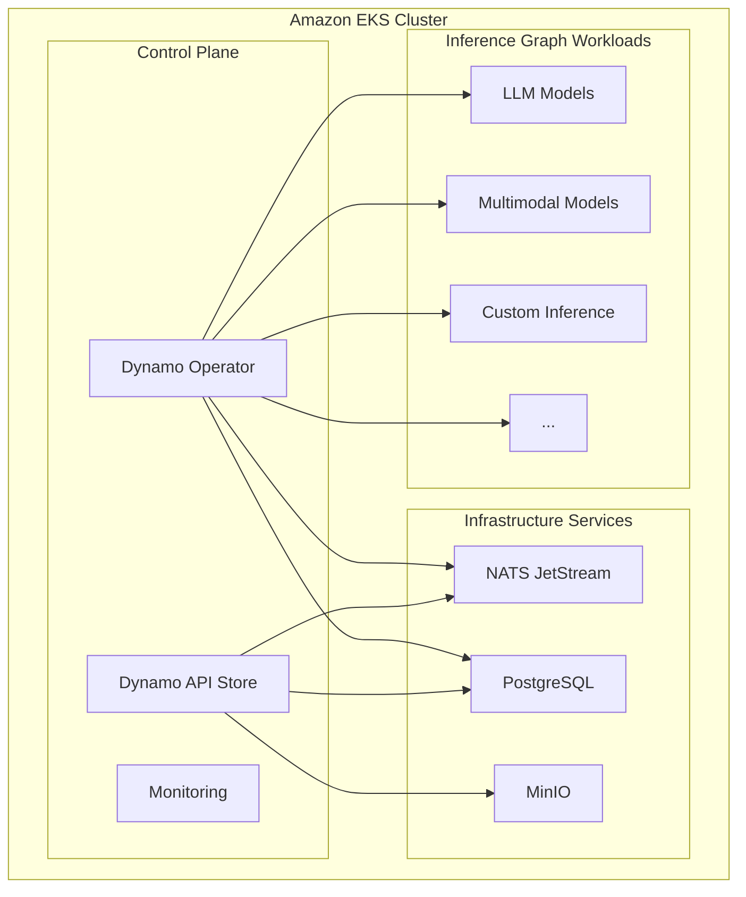

import CollapsibleContent from '../../../../src/components/CollapsibleContent';

:::warning
Deployment of ML models on EKS requires access to GPUs or Neuron instances. If your deployment isn't working, it's often due to missing access to these resources. Also, some deployment patterns rely on Karpenter autoscaling and static node groups; if nodes aren't initializing, check the logs for Karpenter or Node groups to resolve the issue.
:::

:::info
NVIDIA Dynamo is a cloud-native platform for deploying and managing AI inference graphs at scale. This implementation provides complete infrastructure setup with enterprise-grade monitoring and scalability on Amazon EKS.
:::

# NVIDIA Dynamo on Amazon EKS

## What is NVIDIA Dynamo?

NVIDIA Dynamo is an open-source inference framework designed to optimize performance and scalability for large language models (LLMs) and generative AI applications. An inference graph is a computational workflow that defines how AI models process data through interconnected nodes, enabling complex multi-step AI operations like LLM chains, multimodal processing, and custom inference pipelines. It addresses the challenges of traditional inference systems, especially in distributed, multi-node environments.

### Key Features

**Performance Optimizations:**
- **Disaggregated Serving**: Separates prefill and decode phases across different GPUs for optimal resource utilization
- **Dynamic GPU Scheduling**: Intelligent resource allocation based on real-time demand
- **Smart Request Routing**: Minimizes KV cache recomputation by routing requests to workers with relevant cached data
- **Accelerated Data Transfer**: Low-latency communication via NVIDIA NIXL library
- **Efficient KV Cache Management**: Intelligent offloading across memory hierarchies

**Infrastructure Ready:**
- **Inference Engine Agnostic**: Supports TensorRT-LLM, vLLM, SGLang, and others
- **Modular Design**: Pick and choose components that fit your existing AI stack
- **Enterprise Grade**: Complete monitoring, logging, and security integration
- **Amazon EKS Optimized**: Leverages EKS autoscaling, GPU support, and AWS services

## Architecture



## Overview

This blueprint provides a walkthrough for deploying NVIDIA Dynamo Cloud on Amazon EKS, covering infrastructure provisioning, platform installation, base image creation, inference graph deployment, testing, custom graph configuration, and cleanup.

The steps to provision an EKS cluster are provided as scripts and Terraform modules in the ai-on-eks repository. It covers:

- **End-to-end Infrastructure**: VPC, EKS cluster (with GPU nodes), ECR registries, monitoring stack
- **Dynamo Platform**: Operator, API Store, and required services (NATS, PostgreSQL, MinIO)
- **Inference Base Images**: vLLM, TensorRT-LLM, SGLang, or custom
- **Graph Deployment**: Interactive picker or direct example scripts
- **Observability**: Automatic Prometheus/Grafana integration, ServiceMonitor creation
- **Cleanup**: Safe teardown via provided cleanup script

AI-on-EKS is a repository under awslabs that provides infrastructure blueprints, deployment patterns, benchmarks and best practices for running AI/ML workloads on Amazon EKS.

<CollapsibleContent header={<h2><span>Deploying the Solution</span></h2>}>

### Prerequisites

Install the following tools required for cluster management, container builds, and Terraform-based provisioning on your setup host, ideally an EC2 instance t3.xlarge or higher with permissions to interact with EKS and ECR services:

- **AWS CLI**: `aws` for IAM, ECR, and EKS operations ([installation guide](https://docs.aws.amazon.com/cli/latest/userguide/getting-started-install.html))
- **kubectl**: Kubernetes control plane interface ([installation guide](https://kubernetes.io/docs/tasks/tools/install-kubectl/))
- **helm**: Package manager for Kubernetes charts ([installation guide](https://helm.sh/docs/intro/install/))
- **terraform**: Infrastructure-as-code for AWS resources ([installation guide](https://learn.hashicorp.com/tutorials/terraform/install-cli))
- **docker**: Container builds and image pushes ([installation guide](https://docs.docker.com/get-docker/))
- **earthly**: Multi-stage builds for Dynamo platform images - A build automation tool for containerized workflows ([installation guide](https://earthly.dev/get-earthly))
- **Python 3.10+**: Virtual environment for Dynamo CLI ([installation guide](https://www.python.org/downloads/))
- **git**: Repository cloning and version control ([installation guide](https://git-scm.com/book/en/v2/Getting-Started-Installing-Git))

Most prerequisites can be installed using package managers. Refer to the ai-on-eks repository documentation for detailed installation instructions for your platform.

### Step 1: Clone the Repository

```bash
git clone https://github.com/awslabs/ai-on-eks.git && cd ai-on-eks
```

This will be the folder structure that we will be working with going forward:

```
AI-on-EKS Repository (ai-on-eks)
│
├─ infra/nvidia-dynamo/
│   ├─ install.sh               # Terraform + platform bootstrap
│   ├─ cleanup.sh               # Safe resource teardown
│   └─ terraform/               # Dynamo-specific terraform configurations
│
├─ blueprints/inference/nvidia-dynamo/
│   ├─ build-base-image.sh      # Mandatory base image builder
│   ├─ deploy.sh                # Interactive and direct graph deployment
│   └─ test.sh                  # Platform and graph smoke tests
│
└─ infra/base/terraform/        # Shared Terraform modules (VPC, EKS, monitoring)
```

### Step 2: Provision Infrastructure & Install Dynamo Cloud Platform

Navigate to the `infra/nvidia-dynamo` folder and run the installer script. It wraps Terraform and Earthly to create AWS resources and deploy the Dynamo platform:

```bash
cd infra/nvidia-dynamo
./install.sh

# When ready to cleanup resources (requires supervision)
./cleanup.sh
```

**Process Details:**

1. **Terraform Apply** (`terraform/`):
   - VPC, subnets, security groups, NAT gateways
   - EKS cluster with CPU and GPU node groups using Karpenter
   - ECR repositories for Dynamo images
   - Monitoring stack: Prometheus, Grafana, ServiceMonitor
   - EFS CSI driver for shared storage

2. **Platform Bootstrap**:
   - Python venv under blueprints/inference/nvidia-dynamo/
   - `pip install ai-dynamo[all]`
   - `pip install tensorboardX` (to use the planner component to autoscale dynamo workers)
   - Clone ai-dynamo/dynamo@v0.3.1
   - `dynamo_env.sh` generated with AWS vars
   - Note: These files are in .gitignore and will not be committed to the repository

3. **Platform Image Build**:
   - Earthly builds and pushes Operator & API Store images
   - Tags pushed to ECR
   - Note: Custom image builds are required as official Dynamo images are not yet available from NVIDIA. These will be available in future releases.

4. **Platform Deployment**:
   - Helm or kubectl deploys Dynamo Operator, API Store, NATS, PostgreSQL, MinIO
   - Verifies pods and services

**Estimated Duration**: 15–30 minutes depending on AWS region and network

:::caution
The NVIDIA Dynamo infrastructure includes custom Karpenter node pools optimized for AI workloads. By default, it uses AL2023 AMI which has user namespaces enabled. You can optionally use Bottlerocket AMI by setting `use_bottlerocket = true` in the terraform configuration.
:::

### Step 3: Build Base Images

Before deploying any inference graphs, you must build and push the base images that contain your chosen inference engine (e.g., vllm). These images are referenced by the Dynamo Cloud Operator when creating graph workloads:

```bash
cd blueprints/inference/nvidia-dynamo
source dynamo_env.sh  # loads AWS_ACCOUNT_ID, AWS_REGION, IMAGE_TAG

# Build and push for your preferred inference engine using any of these
./build-base-image.sh vllm [tensorrtllm sglang] --push
```

Each run performs:
- Framework installation (CUDA, drivers, libraries)
- Image tagging as `${AWS_ACCOUNT_ID}.dkr.ecr.${AWS_REGION}.amazonaws.com/${IMAGE_TAG}-{framework}`
- Push to ECR

:::warning
Skipping this step will cause graph deployments to fail. Building only once per framework is sufficient unless your framework version changes.
:::

### Step 4: Deploy Inference Graphs

With the platform and base images ready, you can deploy inference graphs. The deploy.sh script supports both interactive selection and direct example deployment.

```bash
cd blueprints/inference/nvidia-dynamo
source dynamo_env.sh

# Launch interactive menu
./deploy.sh
```

Options include:
- **Example Type**: llm
- **LLM Architectures**: agg, disagg, agg_router, disagg_router, multinode-405b, etc.
- **Automatic configuration** of image tags, namespaces, and monitoring resources

**Behind the Scenes:**
1. Runs `dynamo build graphs.{arch}:Frontend` and captures image tag
2. Executes `dynamo deployment create` against the API Store
3. Operator builds and deploys Kubernetes resources: Deployments, Services, ServiceMonitor
4. Graph runs in the `dynamo-cloud` namespace with monitoring enabled

</CollapsibleContent>

## Testing and Validation

### Validate with Smoke Tests

Use the built-in test script to confirm platform and graph health:

```bash
cd blueprints/inference/nvidia-dynamo
./test.sh            # tests platform endpoints and default graph
```

Tests include:
- `/healthz` and `/metrics` checks for Operator and API Store
- Inference request round-trip for each graph
- Prometheus scrape verification

### Manual Testing

```bash
kubectl port-forward svc/<name-of-frontend> 8000:8000 -n dynamo-cloud &

curl -X POST http://localhost:8000/v1/chat/completions \
  -H "Content-Type: application/json" \
  -d '{"model":"my-model","messages":[{"role":"user","content":"What is quantum computing?"}]}'
```

## Deploying Custom Graphs

To deploy your own model or graph:

### 1. Prepare Configuration

Copy an existing example YAML under `examples/llm/configs/`:

```bash
cp examples/llm/configs/disagg_router.yaml examples/llm/configs/my-model.yaml
```

Edit `my-model.yaml`:
- `Common.model`: Hugging Face model ID or custom registry path
- `Frontend.served_model_name`: same as model (must match exactly)
- Resource fields (tensor-parallel-size, GPU counts, memory)
- `max-model-len`, `block-size`, and any custom settings
- Always ensure `model` and `served_model_name` fields match exactly

### 2. Build & Deploy

```bash
source dynamo_env.sh

# Build
BUILD_OUTPUT=$(dynamo build graphs.my-model:Frontend)
TAG=$(echo "$BUILD_OUTPUT" | grep Successfully | awk '{print $3}' | sed 's/.$//')
echo "Built graph → $TAG"

# Deploy
dynamo deployment create "$TAG" \
  -n "my-model-deploy" \
  -f "examples/llm/configs/my-model.yaml" \
  --endpoint "$DYNAMO_CLOUD" \
  --no-wait
```

### 3. Monitor & Test

- Check pods, logs, metrics
- Port-forward the frontend and issue test requests

## Monitoring and Observability

### Grafana Dashboard

Access Grafana at http://localhost:3000:

```bash
kubectl port-forward -n kube-prometheus-stack svc/kube-prometheus-stack-grafana 3000:80
```

### Prometheus Metrics

Access Prometheus at http://localhost:9090:

```bash
kubectl port-forward -n kube-prometheus-stack svc/prometheus 9090:80
```

### Metrics Collection

Check ServiceMonitor resources under monitoring namespace for automatic metrics collection of your deployed inference graphs.

## Cleanup

When you're done, remove all AWS resources cleanly using the provided script:

```bash
cd infra/nvidia-dynamo
./cleanup.sh
```

The `cleanup.sh` script destroys resources in the correct order, ensuring EKS, ECR, and ancillary services are removed without manual Terraform commands.

## Troubleshooting

### Common Issues

1. **GPU Node Not Available**: Check Karpenter logs and ensure GPU instance types are available in your region
2. **Image Pull Errors**: Verify ECR repositories exist and images were pushed successfully
3. **Platform Pods Failing**: Check resource limits and ensure sufficient cluster capacity
4. **Graph Deployment Timeout**: Verify base images are built and available in ECR

### Debug Commands

```bash
# Check platform pods
kubectl get pods -n dynamo-cloud

# Check operator logs
kubectl logs -n dynamo-cloud deployment/dynamo-operator

# Check API store logs
kubectl logs -n dynamo-cloud deployment/dynamo-api-store

# Check graph status
dynamo deployment list --endpoint "$DYNAMO_CLOUD"
```

## Advanced Configuration

### Custom Karpenter Node Pools

This implementation includes custom Karpenter node pools optimized for NVIDIA Dynamo workloads with higher priority than base addons and BuildKit support.

#### Features

- **Higher Priority**: Weight 100 vs base addons weight 50 for Dynamo workload priority
- **Dual AMI Support**: AL2023 (default) or Bottlerocket with user namespace configuration
- **BuildKit Compatible**: Includes user namespace configuration for rootless BuildKit
- **Optimized Instance Types**: C7i for CPU workloads, G6 for GPU workloads

#### Node Pool Types

**C7i CPU Node Pool:**
- Instance Family: c7i (latest generation compute optimized)
- Instance Sizes: large to 48xlarge
- Use Cases: CPU-intensive workloads, BuildKit, general compute
- Labels: `dynamo.ai/node-type: c7i-cpu`, `dynamo.ai/buildkit-compatible: true`

**G6 GPU Node Pool:**
- Instance Family: g6 (NVIDIA L4 GPUs)
- Instance Sizes: large to 48xlarge
- Use Cases: GPU workloads, ML inference, training
- Labels: `dynamo.ai/node-type: g6-gpu`, `dynamo.ai/buildkit-compatible: true`, `accelerator: nvidia`, `gpuType: l4`
- Taints: `nvidia.com/gpu=true:NoSchedule`

#### Configuration Options

The custom node pools can be configured in `infra/nvidia-dynamo/terraform/blueprint.tfvars`:

```hcl
# Enable custom node pools
enable_custom_karpenter_nodepools = true

# Choose AMI family (default: AL2023 - recommended)
use_bottlerocket = false  # true for Bottlerocket with user namespaces

# Resource limits (adjust based on workload needs)
karpenter_cpu_limits = 10000
karpenter_memory_limits = 10000
```

#### AMI Family Considerations

**AL2023 (Default - Recommended):**
- User namespaces enabled by default in kernel
- Better compatibility for most workloads
- Best for BuildKit and general use

**Bottlerocket (Optional):**
- Minimal attack surface, immutable OS
- Custom configuration sets `user.max_user_namespaces = 16384`
- Best for security-focused deployments

#### Node Selection

To schedule pods on specific custom nodes, use node selectors:

```yaml
# For C7i CPU nodes
nodeSelector:
  dynamo.ai/node-type: c7i-cpu
  dynamo.ai/buildkit-compatible: "true"

# For G6 GPU nodes
nodeSelector:
  dynamo.ai/node-type: g6-gpu
  dynamo.ai/buildkit-compatible: "true"
```

#### Verification

After deployment, verify the custom node pools:

```bash
kubectl get nodepools
kubectl get ec2nodeclasses
kubectl get nodes --show-labels
```

For additional support, refer to the [NVIDIA Dynamo documentation](https://docs.nvidia.com/dynamo/) and the [ai-on-eks GitHub repository](https://github.com/awslabs/ai-on-eks).
