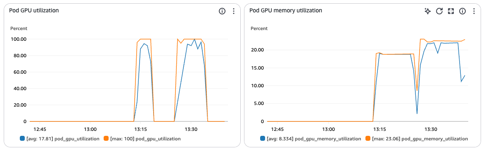
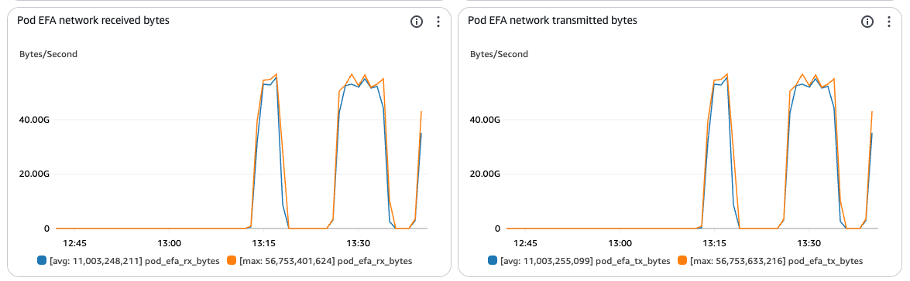

import CollapsibleContent from '../../../../src/components/CollapsibleContent';

# Slurm on EKS

:::warning
Deployment of ML models on EKS requires access to GPUs or Neuron instances. If your deployment isn't working, it’s often due to missing access to these resources. Also, some deployment patterns rely on Karpenter autoscaling and static node groups; if nodes aren't initializing, check the logs for Karpenter or Node groups to resolve the issue.
:::

### What is Slurm?

[Slurm](https://slurm.schedmd.com/overview.html) is an open-source, highly scalable workload manager and job scheduler designed for managing compute resources on compute clusters of all sizes. It provides three core functions: allocating access to compute resources, providing a framework for launching and monitoring parallel computing jobs, and managing queues of pending work to resolve resource contention.

Slurm is widely used in AI training to manage and schedule large-scale, GPU-accelerated workloads across high-performance computing clusters. It allows researchers and engineers to efficiently allocate computing resources, including CPUs, GPUs and memory, enabling distributed training of deep learning models and large language models by spanning jobs across many nodes with fine-grained control over resource types and job priorities. Slurm’s reliability, advanced scheduling features, and integration with both on-premise and cloud environments make it a preferred choice for handling the scale, throughput, and reproducibility that modern AI research and industry demand.

### What is the Slinky Project?

The [Slinky Project](https://github.com/SlinkyProject) is an open-source suite of integration tools designed by [SchedMD](https://www.schedmd.com/) (the lead developers of Slurm) to bring Slurm capabilities into Kubernetes, combining the best of both worlds for efficient resource management and scheduling. The Slinky Project includes a [Kubernetes operator for Slurm clusters](https://github.com/SlinkyProject/slurm-operator?tab=readme-ov-file#kubernetes-operator-for-slurm-clusters), which implements [custom-controllers](https://kubernetes.io/docs/concepts/extend-kubernetes/api-extension/custom-resources/#custom-controllers) and [custom resource definitions (CRDs)](https://kubernetes.io/docs/concepts/extend-kubernetes/api-extension/custom-resources/#customresourcedefinitions) to manage the lifecycle of Slurm Cluster and NodeSet resources deployed within a Kubernetes environment.

This Slurm cluster includes the following components:
| Component | Description |
|-----------|-------------|
| Controller (slurmctld) | The central management daemon that monitors resources, accepts jobs, and assigns work to compute nodes. |
| Accounting (slurmdbd) | Handles job accounting and user/project management through a MariaDB database backend. |
| Compute (slurmd) | The worker nodes that execute jobs, organized into NodeSets which can be grouped into different partitions. |
| Login | Provides SSH access points for users to interact with the Slurm cluster and submit jobs. |
| REST API (slurmrestd) | Offers HTTP-based API access to Slurm functionality for programmatic interaction with the cluster. |
| Authentication (sackd) | Manages credential authentication for secure access to Slurm services. |
| MariaDB | The database backend used by the accounting service to store job, user, and project information. |
| Slurm Exporter | Collects and exports Slurm metrics for monitoring purposes. |

When paired with Amazon EKS, the Slinky Project unlocks the ability for enterprises who have standardized infrastructure management on Kubernetes to deliver a Slurm-based experience to their ML scientists. It also enables training, experimentation, and inference to happen on the same cluster of accelerated nodes.

### Slurm on EKS Architecture


The diagram above depicts the Slurm on EKS deployment outlined in this guide. An Amazon EKS cluster acts as an orchestration layer, with core Slurm Cluster components hosted on a managed node group of m5.xlarge instances, while a Karpenter NodePool manages the deployment of GPU accelerated compute nodes for the slurmd pods to run on. The Slinky Slurm operator and Slurm cluster are automatically deployed as ArgoCD applications.

The login LoadBalancer type service is annotated to dynamically create an AWS Network Load Balancer using the [AWS Load Balancer Controller](https://github.com/kubernetes-sigs/aws-load-balancer-controller), allowing ML scientists to SSH into the login pod without interfacing with the Kubernetes API server via kubectl.

The login and slurmd pods also have an [Amazon FSx for Lustre](https://aws.amazon.com/fsx/lustre/) shared filesystem mounted. Having containerized slurmd pods allows many dependencies that would traditionally be installed manually using Conda or a Python virtual environment to be baked into the container image, but shared filesystems are still beneficial for storing training artifacts, data, logs, and checkpoints.

### Key Features and Benefits

- Run Slurm workloads side by side with containerized Kubernetes applications on the same infrastructure. Both Slurm and Kubernetes workloads can be scheduled on the same node pools, increasing utilization and avoiding resource fragmentation.
- Manage both Slurm jobs and Kubernetes pods seamlessly, leveraging familiar tooling from both ecosystems without sacrificing control or performance.
- Dynamically add or removes compute nodes in response to workload demand, autoscaling allocated resources efficiently, handling spikes and lulls in demand to reduce infrastructure costs and idle resource waste.
- High-availability through Kubernetes orchestration. If a controller or worker pod fails, Kubernetes automatically restarts it, reducing manual intervention.
- Slurm’s sophisticated scheduling features (fair-share allocation, dependency management, priority scheduling) are integrated into Kubernetes, maximizing compute utilization and aligning resources with workload requirements.
- Slurm and its dependencies are deployed as containers, ensuring consistent deployments across environments. This reduces configuration drift and streamlines dev-to-prod transitions.
- Users can build Slurm images tailored to specialized needs (e.g., custom dependencies, libraries), promoting consistency and repeatability in scientific or regulated environments.
- Administrators can define custom Slurm clusters and node sets directly using Kubernetes Custom Resources, including partitioning compute nodes for different types of jobs (e.g., stable vs. opportunistic/backfill partitions)
- Slinky integrates with monitoring stacks for both Slurm and Kubernetes, providing robust metrics and visualization for administrators and users.

<CollapsibleContent header={<h2><span>Deploying the Solution</span></h2>}>

In this example, you will provision a Slinky Slurm cluster on Amazon EKS.

**0. Prerequisites:**

Ensure that you have installed the following tools on your machine.

1. [aws cli](https://docs.aws.amazon.com/cli/latest/userguide/install-cliv2.html)
2. [kubectl](https://Kubernetes.io/docs/tasks/tools/)
3. [terraform](https://learn.hashicorp.com/tutorials/terraform/install-cli)
4. [docker](https://docs.docker.com/engine/install/)

**1. Clone the repository:**

```bash
git clone https://github.com/awslabs/ai-on-eks.git
```

:::info
If you are using profile for authentication
set your `export AWS_PROFILE="<PROFILE_name>"` to the desired profile name
:::

**2. Review and customize configurations:**

- Check available addons in `infra/base/terraform/variables.tf`
- Modify addon settings in `infra/slinky-slurm/terraform/blueprint.tfvars` as needed.

**3. Review the slurmd container image build automation:**

By default, the `blueprints/training/slinky-slurm/install.sh` script will trigger setup steps to automatically build a new slurmd container image using the `blueprints/training/slinky-slurm/dlc-slurmd.Dockerfile`, which builds on top of an [AWS Deep Learning Container (DLC)](https://github.com/aws/deep-learning-containers) to include Python 3.12.8 + PyTorch 2.6.0 + CUDA 12.6 + NCCL 2.23.4 + EFA Installer 1.38.0 (bundled with OFI NCCL plugin) pre-installed in the container image.

It will then create a new ECR repository and push this image to the repository. If not already present on your machine, a new SSH key `~/.ssh/id_ed25519_slurm` will be created for Slurm login pod access as well.

The image repository URI, image tag, and public SSH key are then used to generate a new `slurm-values.yaml` file based on the `blueprints/training/slinky-slurm/slurm-values.yaml.template` file to be used in the deployment of the Slurm cluster.

To customize this behavior, you can add the following optional flags:
| Component | Description | Default Value|
|-----------|-------------|-------------|
|`--repo-name`| The name of the ECR repository |dlc-slurmd|
|`--tag`|The image tag |25.05.0-ubuntu24.04|
|`--region`| The AWS region of your ECR repository | inferred from the AWS CLI configuration or set to `us-west-2`|
|`--skip-build`| Set if using an existing image already in ECR | `false`|
|`--skip-setup`| Set if you previously generate a `blueprints/training/slinky-slurm/slurm-values.yaml` file |`false`|
|`--help`| View flag options |`false`|

For example, if you've already built and pushed a custom slurmd container image to a custom ECR repository, add the following flags and values:
```bash
cd ai-on-eks/blueprints/training/slinky-slurm
./install.sh --repo-name dlc-slurmd --tag 25.05.0-ubuntu24.04 --skip-build
```
The script will then validate that the container image exists in your ECR repo before proceeding.

If you wish to use a custom Dockerfile, simply overwrite the contents of the `blueprints/training/slinky-slurm/dlc-slurmd.Dockerfile` before executing `blueprints/training/slinky-slurm/install.sh`.

If you wish to build and push your container image without triggering a Terraform deployment, you can also run the `blueprints/training/slinky-slurm/setup.sh` script directly using the same flags. This script will also generate a new `blueprints/training/slinky-slurm/slurm-values.yaml` file for you.

**4. Trigger deployment:**

Navigate into the `slinky-slurm` directory and run `install.sh` script:
```bash
cd ai-on-eks/blueprints/training/slinky-slurm
./install.sh
```
</CollapsibleContent>

<CollapsibleContent header={<h3><span>Verify Deployment</span></h3>}>

**0. Check Kubernetes Resources for Slurm Deployment:**

Update your local kubeconfig to access your kubernetes cluster:
```
aws eks update-kubeconfig --name slurm-on-eks
```

Verify the deployment status of the Slinky Slurm Operator:
```
kubectl get all -n slinky
```
```
NAME                                         READY   STATUS    RESTARTS   AGE
pod/slurm-operator-bb5c58dc6-5rsjg           1/1     Running   0          41m
pod/slurm-operator-webhook-87bc59884-vw8rx   1/1     Running   0          41m

NAME                             TYPE        CLUSTER-IP       EXTERNAL-IP   PORT(S)             AGE
service/slurm-operator           ClusterIP   None             <none>        8080/TCP,8081/TCP   41m
service/slurm-operator-webhook   ClusterIP   172.20.229.194   <none>        443/TCP,8081/TCP    41m

NAME                                     READY   UP-TO-DATE   AVAILABLE   AGE
deployment.apps/slurm-operator           1/1     1            1           41m
deployment.apps/slurm-operator-webhook   1/1     1            1           41m

NAME                                               DESIRED   CURRENT   READY   AGE
replicaset.apps/slurm-operator-bb5c58dc6           1         1         1       41m
replicaset.apps/slurm-operator-webhook-87bc59884   1         1         1       41m
```

Verify the deployment status the Slurm Cluster:
```
kubectl get all -n slurm
```
```
NAME                                  READY   STATUS    RESTARTS   AGE
pod/slurm-accounting-0                1/1     Running   0          40m
pod/slurm-compute-node-0              2/2     Running   0          40m
pod/slurm-compute-node-1              2/2     Running   0          40m
pod/slurm-compute-node-2              2/2     Running   0          40m
pod/slurm-compute-node-3              2/2     Running   0          40m
pod/slurm-controller-0                3/3     Running   0          40m
pod/slurm-exporter-79c5896fbc-wrgv9   1/1     Running   0          40m
pod/slurm-login-65bc775dbf-qwtpv      1/1     Running   0          40m
pod/slurm-mariadb-0                   1/1     Running   0          40m
pod/slurm-restapi-859879fbc9-89gjw    1/1     Running   0          40m

NAME                             TYPE           CLUSTER-IP       EXTERNAL-IP                                                                  PORT(S)        AGE
service/slurm-accounting         ClusterIP      None             <none>                                                                       6819/TCP       40m
service/slurm-compute            ClusterIP      None             <none>                                                                       6818/TCP       40m
service/slurm-controller         ClusterIP      None             <none>                                                                       6817/TCP       40m
service/slurm-exporter           ClusterIP      None             <none>                                                                       8080/TCP       40m
service/slurm-login              LoadBalancer   172.20.58.220    k8s-slurm-slurmlog-40c37c19f0-8dcdb95fe5ccfb8b.elb.us-west-2.amazonaws.com   22:31720/TCP   40m
service/slurm-mariadb            ClusterIP      172.20.229.199   <none>                                                                       3306/TCP       40m
service/slurm-mariadb-headless   ClusterIP      None             <none>                                                                       3306/TCP       40m
service/slurm-restapi            ClusterIP      172.20.167.17    <none>                                                                       6820/TCP       40m

NAME                             READY   UP-TO-DATE   AVAILABLE   AGE
deployment.apps/slurm-exporter   1/1     1            1           40m
deployment.apps/slurm-login      1/1     1            1           40m
deployment.apps/slurm-restapi    1/1     1            1           40m

NAME                                        DESIRED   CURRENT   READY   AGE
replicaset.apps/slurm-exporter-79c5896fbc   1         1         1       40m
replicaset.apps/slurm-login-65bc775dbf      1         1         1       40m
replicaset.apps/slurm-restapi-859879fbc9    1         1         1       40m

NAME                                READY   AGE
statefulset.apps/slurm-accounting   1/1     40m
statefulset.apps/slurm-controller   1/1     40m
statefulset.apps/slurm-mariadb      1/1     40m
```
**1. Access the Slurm login Pod:**

SSH into the login pod:
:::info
For this demonstration, the `slurm-login` service has been dynamically annotated using `service.beta.kubernetes.io/load-balancer-source-ranges` to restrict access to the Network Load Balancer with your IP address only. The AWS Load Balancer Controller achieves this by modifying inbound security group rules. For more information see the documentation on [access control annotations](https://kubernetes-sigs.github.io/aws-load-balancer-controller/v2.13/guide/ingress/annotations/#access-control).
:::
```
SLURM_LOGIN_HOSTNAME="$(kubectl get services \
 -n slurm -l app.kubernetes.io/instance=slurm,app.kubernetes.io/name=login \
 -o jsonpath="{.items[0].status.loadBalancer.ingress[0].hostname}")"

ssh -i ~/.ssh/id_ed25519_slurm -p 22 root@$SLURM_LOGIN_HOSTNAME
```
Check the available nodes:
```
sinfo
```
```
PARTITION AVAIL  TIMELIMIT  NODES  STATE NODELIST
node         up   infinite      4   idle node-[0-3]
all*         up   infinite      4   idle node-[0-3]
```
Verify that the Amazon FSx for Lustre shared file system is mounted to the login pod:
```
df -h
```
```
Filesystem                Size  Used Avail Use% Mounted on
overlay                   100G  7.5G   93G   8% /
tmpfs                      64M     0   64M   0% /dev
/dev/nvme0n1p1            100G  7.5G   93G   8% /run
10.1.0.194@tcp:/d2kbdb4v  2.3T   16M  2.3T   1% /fsx
tmpfs                      15G  4.0K   15G   1% /etc/slurm
shm                        64M     0   64M   0% /dev/shm
tmpfs                      15G  4.0K   15G   1% /etc/sssd/sssd.conf
tmpfs                      15G   12K   15G   1% /etc/ssh/ssh_host_rsa_key
tmpfs                     7.7G     0  7.7G   0% /proc/acpi
tmpfs                     7.7G     0  7.7G   0% /sys/firmware
```
Exit back to your machine:
```
exit
```
**2. Access a Slurm Compute Pod:**

Open an interactive terminal session with one of the slurm compute nodes:
```
kubectl -n slurm exec -it pod/slurm-compute-node-0 -- bash --login
```
Verify that the Amazon FSx for Lustre shared file system is mounted to the login pod:
```
df -h
```
```
overlay                   838G   43G  795G   6% /
tmpfs                      64M     0   64M   0% /dev
/dev/root                 798M  798M     0 100% /usr/local/sbin/modprobe
/dev/nvme2n1              838G   43G  795G   6% /run
10.1.0.194@tcp:/d2kbdb4v  2.3T   16M  2.3T   1% /fsx
tmpfs                     122G  4.0K  122G   1% /etc/slurm
tmpfs                      63G     0   63G   0% /dev/shm
tmpfs                     122G  8.0K  122G   1% /var/spool/slurmd
tmpfs                     122G     0  122G   0% /var/log/slurm
tmpfs                      63G   12K   63G   1% /proc/driver/nvidia
tmpfs                      25G  3.9M   25G   1% /run/nvidia-persistenced/socket
```
Check the installed CUDA compiler version on compute node pods:
```
nvcc --version
```
```
# nvcc: NVIDIA (R) Cuda compiler driver
# Copyright (c) 2005-2024 NVIDIA Corporation
# Built on Tue_Oct_29_23:50:19_PDT_2024
# Cuda compilation tools, release 12.6, V12.6.85
# Build cuda_12.6.r12.6/compiler.35059454_0
```
Check the NCCL version on compute node pods:
```
ldconfig -v | grep "libnccl.so" | tail -n1 | sed -r 's/^.*\.so\.//'
```
```
# 2.23.4
```
Check EFA availability:
```
fi_info -p efa
```
```
provider: efa
    fabric: efa
    domain: rdmap0s29-rdm
    version: 122.0
    type: FI_EP_RDM
    protocol: FI_PROTO_EFA
provider: efa
    fabric: efa
    domain: rdmap0s29-dgrm
    version: 122.0
    type: FI_EP_DGRAM
    protocol: FI_PROTO_EFA
```
Check the libfabric libraries:
```
ls /opt/amazon/efa/lib
```
```
libfabric.a  libfabric.so  libfabric.so.1  libfabric.so.1.25.0  pkgconfig
```
Check the OFI NCCL plugin libraries:
```
ls /opt/amazon/ofi-nccl/lib/x86_64-linux-gnu
```
```
libnccl-net.so  libnccl-ofi-tuner.so
```
Verify intra-node GPU topology:
```
nvidia-smi topo -m
```
```
	GPU0	CPU Affinity	NUMA Affinity	GPU NUMA ID
GPU0	 X 	0-31	0		N/A
```
Exit back to your machine:
```
exit
```
</CollapsibleContent>

<CollapsibleContent header={<h3><span>Run FSDP Example</span></h3>}>

**0. Stage Training Artifacts:**

SSH into the login pod:
```
SLURM_LOGIN_HOSTNAME="$(kubectl get services \
 -n slurm -l app.kubernetes.io/instance=slurm,app.kubernetes.io/name=login \
 -o jsonpath="{.items[0].status.loadBalancer.ingress[0].hostname}")"

ssh -i ~/.ssh/id_ed25519_slurm -p 22 root@$SLURM_LOGIN_HOSTNAME
```
Install Git on the login pod:
```
apt update
apt install -y git
git --version
```
Change directories into the FSx mount:
```
cd /fsx
```
Clone the [awsome-distributed-training](https://github.com/aws-samples/awsome-distributed-training) repo:
```
git clone https://github.com/aws-samples/awsome-distributed-training/
```
Change into the FSDP for Slurm example directory:
```
cd awsome-distributed-training/3.test_cases/pytorch/FSDP/slurm
```
Make a new directory for your checkpoints
```
mkdir -p checkpoints
```
:::info
By default the `llama2_7b-training.sbatch` batch training script is configured to distribute the FSDP workload across 4 nodes. The Slurm NodeSet maps to the `g5-gpu-karpenter` NodePool via a `NodeSelector.instanceType` value. If Karpenter is unable to find 4 on-demand or spot instances, you may need to make adjustment to the batch training script, then upload a new copy to your provisioned S3 bucket, which will sync it to the FSx for Lustre file system via a [data repository association](https://docs.aws.amazon.com/fsx/latest/LustreGuide/create-dra-linked-data-repo.html):
```
cd ../../../infra/slinky-slurm/terraform/_LOCAL
S3_BUCKET_NAME=$(terraform output -raw fsx_s3_bucket_name)
cd ../../../../blueprints/training/slinky-slurm
aws s3 cp llama2_7b-training.sbatch s3://${S3_BUCKET_NAME}/
```
:::

Copy the `llama2_7b-training.sbatch` batch training script into the FSDP for Slurm example directory:
```
cp /fsx/data/llama2_7b-training.sbatch ./llama2_7b-training.sbatch
```
**1. Configure Hugging Face Access Token:**

Create a new [Hugging Face](https://huggingface.co/) read [user access token](https://huggingface.co/docs/hub/en/security-tokens) to stream the [allenai/c4](https://huggingface.co/datasets/allenai/c4) dataset without throttling.

Inject the new Hugging Face token into the training script:
```
NEW_TOKEN="<you-token-here>"
```
```
sed -i "s/export HF_TOKEN=.*$/export HF_TOKEN=$NEW_TOKEN/" llama2_7b-training.sbatch
```
**2. Start the training job:**

Submit the batch training script to the Slurm Controller using the [sbatch](https://slurm.schedmd.com/sbatch.html) command:
```
sbatch llama2_7b-training.sbatch
```
```
Submitted batch job 1
```
**3. Monitor trianing progess:**

Watch the output logs from the login pod:
```
export JOB_ID=$(squeue -h -u root -o "%i" | head -1)

tail -f logs/llama2_7b-FSDP_${JOB_ID}.out
```
```
2: node-0:309:309 [0] NCCL INFO AllGather: 37756928 Bytes -> Algo 1 proto 2 time 2860.208008
1: node-3:278:278 [0] NCCL INFO AllGather: opCount 1606 sendbuff 0x93fd44a00 recvbuff 0x96d44e200 count 2359808 datatype 7 op 0 root 0 comm 0x555e2c6387e0 [nranks=4] stream 0x555e2b3a4370
0: node-1:397:397 [0] NCCL INFO AllGather: opCount 1606 sendbuff 0x93fd44a00 recvbuff 0x96d44e200 count 2359808 datatype 7 op 0 root 0 comm 0x55c1eaee2a20 [nranks=4] stream 0x55c1e9c4f3d0
3: node-2:278:278 [0] NCCL INFO AllGather: opCount 1606 sendbuff 0x93fd44a00 recvbuff 0x96d44e200 count 2359808 datatype 7 op 0 root 0 comm 0x5611d45babf0 [nranks=4] stream 0x5611d3327480
1: node-3:278:278 [0] NCCL INFO AllGather: opCount 1607 sendbuff 0x940645200 recvbuff 0x96d44e200 count 2359808 datatype 7 op 0 root 0 comm 0x555e2c6387e0 [nranks=4] stream 0x555e2b3a4370
3: node-2:278:278 [0] NCCL INFO AllGather: opCount 1607 sendbuff 0x940645200 recvbuff 0x96d44e200 count 2359808 datatype 7 op 0 root 0 comm 0x5611d45babf0 [nranks=4] stream 0x5611d3327480
1: node-3:278:278 [0] NCCL INFO Broadcast: opCount 1608 sendbuff 0x302287400 recvbuff 0x302287400 count 1 datatype 4 op 0 root 0 comm 0x555e2c6387e0 [nranks=4] stream 0x555e2b3a4370
0: node-1:397:397 [0] NCCL INFO AllGather: opCount 1607 sendbuff 0x940645200 recvbuff 0x96d44e200 count 2359808 datatype 7 op 0 root 0 comm 0x55c1eaee2a20 [nranks=4] stream 0x55c1e9c4f3d0
3: node-2:278:278 [0] NCCL INFO Broadcast: opCount 1608 sendbuff 0x302287400 recvbuff 0x302287400 count 1 datatype 4 op 0 root 0 comm 0x5611d45babf0 [nranks=4] stream 0x5611d3327480
1: node-3:278:278 [0] NCCL INFO Broadcast: opCount 1609 sendbuff 0x302287600 recvbuff 0x302287600 count 3145 datatype 1 op 0 root 0 comm 0x555e2c6387e0 [nranks=4] stream 0x555e2b3a4370
```
Watch the error logs from `slurm-compute-node-0` (in a new terminal window):
```
kubectl -n slurm exec -it pod/slurm-compute-node-0 -- bash --login
```
```
cd /fsx/awsome-distributed-training/3.test_cases/pytorch/FSDP/slurm
export JOB_ID=$(squeue -h -u root -o "%i" | head -1)

watch "grep 'Batch.*Loss' logs/llama2_7b-FSDP_${JOB_ID}.err"
```
```
2: 2025-07-17 13:14:16 I [train.py:103] Batch 0 Loss: 11.11333, Speed: 0.78 samples/sec, lr: 0.000031
2: 2025-07-17 13:14:16 I [train.py:103] Batch 1 Loss: 11.03250, Speed: 5.84 samples/sec, lr: 0.000063
2: 2025-07-17 13:14:17 I [train.py:103] Batch 2 Loss: 10.93887, Speed: 5.81 samples/sec, lr: 0.000094
2: 2025-07-17 13:14:18 I [train.py:103] Batch 3 Loss: 10.66936, Speed: 5.87 samples/sec, lr: 0.000100
2: 2025-07-17 13:14:18 I [train.py:103] Batch 4 Loss: 10.24629, Speed: 5.83 samples/sec, lr: 0.000100
2: 2025-07-17 13:14:19 I [train.py:103] Batch 5 Loss: 10.05146, Speed: 5.87 samples/sec, lr: 0.000100
2: 2025-07-17 13:14:20 I [train.py:103] Batch 6 Loss: 9.88661, Speed: 5.91 samples/sec, lr: 0.000100
2: 2025-07-17 13:14:20 I [train.py:103] Batch 7 Loss: 9.78694, Speed: 5.87 samples/sec, lr: 0.000100
2: 2025-07-17 13:14:21 I [train.py:103] Batch 8 Loss: 9.61180, Speed: 5.90 samples/sec, lr: 0.000100
2: 2025-07-17 13:14:22 I [train.py:103] Batch 9 Loss: 9.34421, Speed: 5.83 samples/sec, lr: 0.000100
```
Watch squeue from `slurm-compute-node-1` (in a new terminal window):
```
kubectl -n slurm exec -it pod/slurm-compute-node-1 -- bash --login
```
```
# 1 second updates
watch -n 1 squeue
```
```
Every 1.0s: squeue                                                                                                                                node-1: Thu Jul 17 13:18:13 2025

             JOBID PARTITION     NAME     USER ST       TIME  NODES NODELIST(REASON)
                 1       all llama2_7     root  R       4:47      4 node-[0-3]
```
Watch checkpoints from `slurm-compute-node-2` (in a new terminal window):
```
kubectl -n slurm exec -it pod/slurm-compute-node-2 -- bash --login
```
```
cd /fsx/awsome-distributed-training/3.test_cases/pytorch/FSDP/slurm

# highlight changes, show timestamps, 5 second updates
watch -n 5 -d "ls -lh checkpoints"
```
```
Every 5.0s: ls -lh checkpoints                                                                                                                    node-2: Thu Jul 17 13:35:32 2025

total 175K
drwxr-xr-x. 2 root root 25K Jul 17 13:15 llama_v2-100steps
drwxr-xr-x. 2 root root 25K Jul 17 13:16 llama_v2-200steps
drwxr-xr-x. 2 root root 25K Jul 17 13:28 llama_v2-300steps
drwxr-xr-x. 2 root root 25K Jul 17 13:29 llama_v2-400steps
drwxr-xr-x. 2 root root 25K Jul 17 13:30 llama_v2-500steps
drwxr-xr-x. 2 root root 25K Jul 17 13:32 llama_v2-600steps
drwxr-xr-x. 2 root root 25K Jul 17 13:33 llama_v2-700steps
```
Exit back to your machine:
```
exit
```
</CollapsibleContent>

<CollapsibleContent header={<h3><span>CloudWatch Container Insights</span></h3>}>
Navigate to [Amazon CloudWatch Container Insights](https://console.aws.amazon.com/cloudwatch/home?#container-insights:?~(query~()~context~(orchestrationService~'eks))) to view GPU utilization and EFA network metrics:




</CollapsibleContent>

<CollapsibleContent header={<h3><span>Clean Up</span></h3>}>

:::caution
To avoid unwanted charges to your AWS account, delete all the AWS resources created during this deployment.
:::

This script will cleanup the environment using `-target` option to ensure all the resources are deleted in correct order.

```bash
cd ai-on-eks/blueprints/training/slinky-slurm
```
```
./cleanup.sh
```
</CollapsibleContent>
