import Tabs from '@theme/Tabs';
import TabItem from '@theme/TabItem';
import CodeBlock from '@theme/CodeBlock';
import Admonition from '@theme/Admonition';
import StatusGrid from '@site/src/components/StatusGrid';
import StatCallout from '@site/src/components/StatCallout';
import SectionDivider from '@site/src/components/SectionDivider';
import ComparisonTable from '@site/src/components/ComparisonTable';
import ProgressSteps from '@site/src/components/ProgressSteps';

# Dynamic Resource Allocation for GPUs on Amazon EKS

<details>
<summary><strong>🚀 TL;DR – Dynamic GPU Scheduling with DRA on EKS</strong></summary>

**DRA is the next-generation GPU scheduling approach in Kubernetes.** Dynamic Resource Allocation (DRA) provides advanced GPU management capabilities beyond traditional device plugins. Here's what matters:

### DRA Advantages over Traditional GPU Scheduling

- **🎯 Fine-grained resource control** – Request specific GPU memory amounts, not just whole devices
- **🔄 Per-workload sharing strategies** – Choose `mps`, `time-slicing`, `mig`, or `exclusive` per pod, not cluster-wide
- **🧠 Topology-aware scheduling** – Understands [NVLink](https://www.nvidia.com/en-us/data-center/nvlink/), [IMEX](https://docs.nvidia.com/multi-node-nvlink-systems/imex-guide/overview.html), and GPU interconnects for multi-GPU workloads
- **⚡ Advanced GPU features** – Required for [Amazon EC2 P6e-GB200 UltraServers](https://aws.amazon.com/ec2/instance-types/p6/) [IMEX](https://docs.nvidia.com/multi-node-nvlink-systems/imex-guide/overview.html), Multi-Node [NVLink](https://www.nvidia.com/en-us/data-center/nvlink/), and next-gen GPU capabilities
- **🤝 Coexistence-friendly** – Can run alongside traditional device plugins during transition

<Admonition type="warning" title="Amazon EC2 P6e-GB200 UltraServer Requirement">

- **Traditional scheduling unsupported** – Amazon EC2 P6e-GB200 UltraServers **require DRA** and won't work with NVIDIA device plugin + kube-scheduler
- **DRA mandatory** – Multi-Node [NVLink](https://www.nvidia.com/en-us/data-center/nvlink/) and [IMEX](https://docs.nvidia.com/multi-node-nvlink-systems/imex-guide/overview.html) capabilities only available through DRA

</Admonition>

**Key Implementation Details:**

<StatusGrid badges={[
  {
    type: 'production',
    icon: '☸️',
    title: 'EKS Control Plane',
    value: 'v1.33+',
    note: 'DRA feature gates enabled'
  },
  {
    type: 'production',
    icon: '🖥️',
    title: 'EKS Optimized NVIDIA AMI',
    value: 'Latest AMI',
    note: 'Pre-installed drivers'
  },
  {
    type: 'production',
    icon: '🔗',
    title: 'Managed Node Groups',
    value: 'Full DRA Support',
    note: 'Recommended approach'
  },
  {
    type: 'info',
    icon: '🔧',
    title: 'Self-Managed Nodegroups',
    value: 'DRA Support',
    note: 'Manual configuration'
  },
  {
    type: 'production',
    icon: '🛠️',
    title: 'NVIDIA GPU Operator',
    value: 'v25.3.0+',
    note: 'Required for DRA'
  },
  {
    type: 'production',
    icon: '⚡',
    title: 'NVIDIA DRA Driver',
    value: 'v25.3.0+',
    note: 'Core DRA functionality'
  },
  {
    type: 'warning',
    icon: '🚧',
    title: 'Karpenter DRA Support',
    value: 'In Development',
    note: 'GitHub Issue #1231'
  },
  {
    type: 'beta',
    icon: '🔬',
    title: 'DRA Status',
    value: 'Beta (K8s v1.32+)',
    note: 'Technology Preview'
  }
]} />


- **EKS v1.33** – DRA feature gates enabled in EKS-optimized configurations
- **For detailed DRA implementation** – See [Kubernetes DRA documentation](https://kubernetes.io/docs/concepts/scheduling-eviction/dynamic-resource-allocation/)
- **Node provisioning compatibility:**
  - **Managed Node Groups** – Full DRA support 🎯
  - **Self-Managed Node Groups** – DRA support (requires manual configuration) 🔧
  - **Karpenter** – DRA support in development ([Issue #1231](https://github.com/kubernetes-sigs/karpenter/issues/1231)) 🏗️
- **Coexistence** – Traditional device plugin and DRA can run simultaneously

### Why Managed/Self-Managed Node Groups vs Karpenter for DRA?

- **Managed/Self-Managed Node Groups** – Full DRA support, optimized for Capacity Block Reservations
- **Karpenter** – DRA support in development, dynamic scaling conflicts with reserved GPU capacity
- **EKS-optimized AMIs** – Come with pre-installed NVIDIA drivers

### Can I Use Both Traditional GPU Allocation and DRA Together?

- **Coexistence supported** – Both can run simultaneously on the same cluster
- **DRA is the future** – NVIDIA and Kubernetes moving exclusively to DRA
- **Migration strategy** – Use DRA for new workloads, traditional for existing production


### Production Readiness

- **Technology Preview** – GPU allocation and sharing features actively developed by NVIDIA
- **Production Ready** – ComputeDomains for Multi-Node [NVLink](https://www.nvidia.com/en-us/data-center/nvlink/) fully supported
- **Scheduling overhead** – Additional latency due to claim resolution process
- **General Availability** – Expected in Kubernetes v1.34 (2025)
- **Latest status updates** – Follow [NVIDIA DRA Driver GitHub](https://github.com/NVIDIA/k8s-dra-driver-gpu) for current development progress

<Admonition type="tip" title="Additional Resources">

For comprehensive guidance on AI/ML workloads on EKS, see the [AWS EKS Best Practices for AI/ML Compute](https://docs.aws.amazon.com/eks/latest/best-practices/aiml-compute.html#aiml-dra).

</Admonition>

</details>

<StatCallout
  icon="💸"
  title="Enterprise GPU Utilization Crisis"
  statNumber="60%"
  statLabel="GPU capacity wasted"
  description="Despite high demand, enterprise AI platforms consistently waste over half their GPU resources due to scheduling limitations. This represents millions in infrastructure costs."
  type="critical"
/>

**Even in high-demand AI clusters, GPU utilization frequently remains below 40%.** This isn't a configuration issue — it's a fundamental limitation of how Kubernetes abstracts GPU resources. Organizations are paying premium prices for GPU instances while letting the majority of compute power sit idle.

<SectionDivider icon="🎛️" />

## The GPU Scheduling Challenge in Kubernetes

### Current State: Traditional GPU Allocation

Kubernetes has rapidly evolved into the de facto standard for orchestrating AI/ML workloads across enterprise environments, with Amazon EKS emerging as the leading platform for managing GPU-accelerated infrastructure at scale. Organizations are running everything from small inference services to massive distributed training jobs on EKS clusters, leveraging GPU instances like P4d, P5, and the latest P6 series to power their machine learning pipelines.

However, despite Kubernetes' sophistication in managing containerized workloads, the traditional GPU scheduling model remains surprisingly primitive and creates significant operational challenges. The current approach treats GPUs as simple, atomic resources that can only be allocated in whole units, fundamentally mismatched with the diverse and evolving needs of modern AI workloads.

**How Traditional GPU Scheduling Works:**
- Pods request GPUs using simple integer values: `nvidia.com/gpu: 1`
- Scheduler treats GPUs as opaque, indivisible resources
- Each workload gets exclusive access to entire GPU devices
- No awareness of actual resource requirements or GPU topology

**The Problem with This Approach:**
Modern AI workloads have diverse requirements that don't fit this binary model:
- **Small inference jobs** need only 2-4GB GPU memory but get allocated entire 80GB A100s
- **Large training jobs** require coordinated multi-GPU communication via [NVLink](https://www.nvidia.com/en-us/data-center/nvlink/) or [IMEX](https://docs.nvidia.com/multi-node-nvlink-systems/imex-guide/overview.html)
- **Mixed workloads** could share GPUs efficiently but are forced into separate devices

### The GPU Utilization Crisis

<Admonition type="warning" title="Critical Inefficiency in Production">

**Even in high-demand clusters, GPU utilization frequently remains below 40%.** This isn't a configuration issue: it's a fundamental limitation of how Kubernetes abstracts GPU resources.

</Admonition>

**Common symptoms of inefficient GPU allocation:**

- **Queue starvation** - Small inference jobs wait behind long-running training tasks
- **Resource fragmentation** - GPU memory is stranded in unusable chunks across nodes
- **Topology blindness** - Multi-GPU jobs get suboptimal placement, degrading [NVLink](https://www.nvidia.com/en-us/data-center/nvlink/) performance
- **Cost explosion** - Organizations overprovision GPUs to work around scheduling inefficiencies

<SectionDivider icon="💎" />

## Enter Dynamic Resource Allocation (DRA)

### What DRA Changes

Dynamic Resource Allocation fundamentally transforms GPU scheduling in Kubernetes from a rigid, device-centric model to a flexible, workload-aware approach:

**Traditional Approach:**
```yaml
resources:
  limits:
    nvidia.com/gpu: 1  # Get entire GPU, no customization
```

**DRA Approach:**
```yaml
resourceClaims:
- name: gpu-claim
  source:
    resourceClaimTemplateName: gpu-template  # Detailed requirements
```

*See examples section below for ResourceClaimTemplate configurations.*

<Admonition type="warning" title="Namespace Requirement">

**Critical:** ResourceClaims must exist in the same namespace as the Pods that reference them. Cross-namespace resource claims are not supported.

</Admonition>

### Key DRA Innovations

<div className="dra-innovations-grid">
  <div className="innovation-card innovation-card--primary">
    <div className="innovation-card__header">
      <div className="innovation-card__icon">🎯</div>
      <h4>Fine-grained Resource Control</h4>
    </div>
    <div className="innovation-card__content">
      <ul className="innovation-card__features">
        <li>Request specific GPU memory amounts (e.g., 16Gi out of 80Gi available)</li>
        <li>Specify compute requirements independent of memory needs</li>
        <li>Define topology constraints for multi-GPU workloads</li>
      </ul>
      <div className="innovation-card__note">
        <strong>Note:</strong> ResourceClaims and Pods must be in the same namespace
      </div>
    </div>
  </div>

  <div className="innovation-card innovation-card--secondary">
    <div className="innovation-card__header">
      <div className="innovation-card__icon">🔄</div>
      <h4>Per-Workload Sharing Strategies</h4>
    </div>
    <div className="innovation-card__content">
      <div className="strategy-grid">
        <div className="strategy-item">
          <strong>MPS</strong> - Concurrent small workloads with memory isolation
        </div>
        <div className="strategy-item">
          <strong>Time-slicing</strong> - Workloads with different peak usage patterns
        </div>
        <div className="strategy-item">
          <strong>MIG</strong> - Hardware-level isolation in multi-tenant environments
        </div>
        <div className="strategy-item">
          <strong>Exclusive</strong> - Performance-critical training jobs
        </div>
      </div>
    </div>
  </div>

  <div className="innovation-card innovation-card--success">
    <div className="innovation-card__header">
      <div className="innovation-card__icon">🌐</div>
      <h4>Topology-Aware Scheduling</h4>
    </div>
    <div className="innovation-card__content">
      <ul className="innovation-card__features">
        <li>Understands <a href="https://www.nvidia.com/en-us/data-center/nvlink/">NVLink</a> connections between GPUs</li>
        <li>Leverages <a href="https://docs.nvidia.com/multi-node-nvlink-systems/imex-guide/overview.html">IMEX</a> for <a href="https://aws.amazon.com/ec2/instance-types/p6/">Amazon EC2 P6e-GB200 UltraServer</a> clusters</li>
        <li>Optimizes placement for distributed training workloads</li>
      </ul>
    </div>
  </div>

  <div className="innovation-card innovation-card--warning">
    <div className="innovation-card__header">
      <div className="innovation-card__icon">🚀</div>
      <h4>Future-Proof Architecture</h4>
    </div>
    <div className="innovation-card__content">
      <ul className="innovation-card__features">
        <li>Required for next-generation systems like <a href="https://aws.amazon.com/ec2/instance-types/p6/">Amazon EC2 P6e-GB200 UltraServers</a></li>
        <li>Enables advanced features like Multi-Node <a href="https://www.nvidia.com/en-us/data-center/nvlink/">NVLink</a></li>
        <li>Supports emerging GPU architectures and sharing technologies</li>
      </ul>
    </div>
  </div>
</div>

<style jsx>{`
.dra-innovations-grid {
  display: grid;
  grid-template-columns: repeat(auto-fit, minmax(320px, 1fr));
  gap: 1.5rem;
  margin: 2rem 0;
}

.innovation-card {
  background: var(--ifm-background-surface-color);
  border: 1px solid var(--ifm-color-emphasis-300);
  border-radius: 12px;
  padding: 1.5rem;
  transition: all 0.3s ease;
  box-shadow: 0 2px 8px rgba(0, 0, 0, 0.1);
}

.innovation-card:hover {
  transform: translateY(-4px);
  box-shadow: 0 8px 25px rgba(0, 0, 0, 0.15);
}

.innovation-card--primary {
  border-left: 4px solid var(--ifm-color-primary);
}

.innovation-card--secondary {
  border-left: 4px solid var(--ifm-color-secondary);
}

.innovation-card--success {
  border-left: 4px solid var(--ifm-color-success);
}

.innovation-card--warning {
  border-left: 4px solid var(--ifm-color-warning);
}

.innovation-card__header {
  display: flex;
  align-items: center;
  margin-bottom: 1rem;
}

.innovation-card__icon {
  font-size: 2rem;
  margin-right: 0.75rem;
}

.innovation-card__header h4 {
  margin: 0;
  font-size: 1.25rem;
  font-weight: 600;
}

.innovation-card__content {
  color: var(--ifm-color-content-secondary);
}

.innovation-card__features {
  margin: 0;
  padding-left: 1rem;
}

.innovation-card__features li {
  margin-bottom: 0.5rem;
}

.innovation-card__note {
  background: var(--ifm-color-warning-contrast-background);
  border: 1px solid var(--ifm-color-warning-contrast-border);
  border-radius: 6px;
  padding: 0.75rem;
  margin-top: 1rem;
  font-size: 0.875rem;
}

.strategy-grid {
  display: grid;
  grid-template-columns: 1fr 1fr;
  gap: 0.75rem;
}

.strategy-item {
  background: var(--ifm-color-emphasis-100);
  padding: 0.75rem;
  border-radius: 6px;
  font-size: 0.875rem;
  border-left: 3px solid var(--ifm-color-secondary);
}

@media (max-width: 768px) {
  .dra-innovations-grid {
    grid-template-columns: 1fr;
  }

  .strategy-grid {
    grid-template-columns: 1fr;
  }
}
`}</style>

### Understanding IMEX, ComputeDomains, and Amazon EC2 P6e-GB200 Multi-Node Scheduling

**[IMEX](https://docs.nvidia.com/multi-node-nvlink-systems/imex-guide/overview.html) (NVIDIA Internode Memory Exchange/Management Service)** is NVIDIA's orchestration service for GPU memory sharing across [NVLink](https://www.nvidia.com/en-us/data-center/nvlink/) multi-node deployments. In [Amazon EC2 P6e-GB200 UltraServer](https://aws.amazon.com/ec2/instance-types/p6/) configurations, IMEX coordinates memory export and import operations between nodes, enabling direct GPU-to-GPU memory access across multiple compute nodes for massive AI model training with billions of parameters.

**ComputeDomains** represent logical groupings of interconnected GPUs that can communicate efficiently through high-bandwidth connections like [NVLink](https://www.nvidia.com/en-us/data-center/nvlink/) or [IMEX](https://docs.nvidia.com/multi-node-nvlink-systems/imex-guide/overview.html). DRA uses ComputeDomains to understand GPU topology and ensure workloads requiring multi-GPU coordination are scheduled on appropriately connected hardware.

**Amazon EC2 P6e-GB200 Multi-Node Scheduling** leverages DRA's topology awareness to coordinate workloads across multiple superchip nodes. Traditional GPU scheduling cannot understand these complex interconnect relationships, making DRA essential for optimal placement of distributed training jobs on [Amazon EC2 P6e-GB200 UltraServer](https://aws.amazon.com/ec2/instance-types/p6/) systems where proper GPU topology selection directly impacts training performance.

For detailed configuration examples and implementation guidance, see the [AWS EKS AI/ML Best Practices documentation](https://docs.aws.amazon.com/eks/latest/best-practices/aiml-compute.html#aiml-dra).

## Implementation Considerations for EKS

Now that we understand DRA's capabilities and advanced features like IMEX and ComputeDomains, let's explore the practical considerations for implementing DRA on Amazon EKS. The following sections address key decisions around node provisioning, migration strategies, and EKS-specific configurations that will determine your DRA deployment success.

### Managed Node Groups vs Karpenter for P-Series GPU Instances and DRA

The choice between node provisioning methods for DRA isn't just about technical compatibility. It's fundamentally about how GPU capacity is purchased and utilized in enterprise AI workloads. **Managed and Self-Managed Node Groups are currently the recommended approach for DRA because they align with the economics and operational patterns of high-end GPU instances.**

Here's why: The majority of large GPU instances ([P4d](https://aws.amazon.com/ec2/instance-types/p4/) (A100), [P5](https://aws.amazon.com/ec2/instance-types/p5/) (H100), [P6 with B200](https://aws.amazon.com/ec2/instance-types/p6/), and [P6e with GB200](https://www.nvidia.com/en-us/data-center/gb200-nvl72/)) are primarily available through AWS Capacity Block Reservations rather than on-demand pricing. **When organizations purchase Capacity Blocks, they commit to paying for every second of GPU time until the reservation expires, regardless of whether the GPUs are actively utilized.** This creates a fundamental mismatch with Karpenter's core value proposition of dynamic scaling based on workload demand. Spinning nodes down during low-demand periods doesn't save money. It actually wastes the reserved capacity you're already paying for.

Additionally, **Karpenter doesn't yet support DRA scheduling** ([Issue #1231](https://github.com/kubernetes-sigs/karpenter/issues/1231) tracks active development), making it incompatible with production DRA workloads. While Karpenter excels at cost optimization through dynamic scaling for general compute workloads, **Capacity Block reservations require an "always-on" utilization strategy to maximize ROI**: exactly what Managed Node Groups provide with their static capacity model.

**The future picture is more optimistic:** Karpenter's roadmap includes static node features that would make it suitable for Capacity Block scenarios. The community is actively working on [manual node provisioning without workloads](https://github.com/kubernetes-sigs/karpenter/issues/749) and static provisioning capabilities through RFCs like [static provisioning](https://github.com/kubernetes-sigs/karpenter/pull/2309) and [manual node provisioning](https://github.com/kubernetes-sigs/karpenter/pull/2397). Once DRA support is added alongside these static provisioning capabilities, Karpenter could become the preferred choice for DRA workloads with Capacity Block ML reserved instances. Until then, **Managed Node Groups with EKS-optimized AMIs (which come with pre-installed NVIDIA drivers) provide the most reliable foundation for DRA implementations.**

### DRA and Traditional GPU Allocation Coexistence

**Yes, but with careful configuration to avoid conflicts.** DRA and traditional GPU allocation can coexist on the same cluster, but this requires thoughtful setup to prevent resource double-allocation issues. NVIDIA's DRA driver is designed as an additional component alongside the GPU Operator, with selective enablement to avoid conflicts.

**The recommended approach for gradual migration:** Configure the NVIDIA DRA driver to enable only specific subsystems initially. For example, you can set `resources.gpus.enabled=false` to use traditional device plugins for GPU allocation while enabling DRA's ComputeDomain subsystem for Multi-Node NVLink capabilities. This allows teams to gain operational experience with DRA's advanced features without risking established GPU allocation workflows.

**Key considerations for coexistence:**
- **Avoid same-device conflicts**: DRA and device plugins should not manage the same GPU devices simultaneously
- **Selective component enablement**: Use NVIDIA DRA driver's modular design to enable features gradually
- **Node selector management**: Configure node selectors carefully to prevent resource allocation conflicts
- **Technology Preview status**: GPU allocation and sharing features are in Technology Preview (check [NVIDIA DRA Driver GitHub](https://github.com/NVIDIA/k8s-dra-driver-gpu) for updates)

**For migration planning,** start with DRA's production-ready features like ComputeDomains for Multi-Node [NVLink](https://www.nvidia.com/en-us/data-center/nvlink/), while keeping traditional device plugins for core GPU allocation. Once DRA's GPU allocation reaches full support, gradually migrate workloads starting with development and inference services before moving mission-critical training jobs. **NVIDIA and the Kubernetes community have designed DRA as the eventual replacement for device plugins**, but the transition requires careful orchestration to maintain cluster stability.

### Visual Comparison: Traditional vs DRA

The diagram below illustrates how DRA fundamentally changes the scheduling flow:

- **Traditional Model**: The pod directly requests an entire GPU via the node resource model. Scheduling and allocation are static, with no room for partial usage or workload intent.
- **DRA Model**: Pods express intent via templates; claims are dynamically generated and resolved with the help of a DRA-aware scheduler and device driver. Multiple workloads can share GPUs safely and efficiently, maximizing utilization.

```mermaid
flowchart TB

%% --- Traditional Device Plugin Model ---
subgraph Traditional ["🔴 Traditional Device Plugin"]
    direction TB
    T_Spacer[" "]
    T_Pod["🚀 Pod<br/>resources: nvidia.com/gpu: 1"]
    T_Scheduler["⚡ Scheduler<br/>Finds Node with GPU"]
    T_Node["🖥️ Node<br/>with Device Plugin"]
    T_GPU["🎯 GPU<br/>💔 Static Configuration<br/>Cluster-wide Policies"]

    T_Spacer ~~~ T_Pod
    T_Pod --> T_Scheduler
    T_Scheduler --> T_Node
    T_Node --> T_GPU
end

%% --- DRA Model ---
subgraph DRA ["🟢 Dynamic Resource Allocation"]
    direction TB

    %% Spacer for title
    D_Spacer[" "]

    %% User Intent
    D_Pod1["🚀 Pod A<br/>Inference Workload"]
    D_Pod2["🚀 Pod B<br/>Training Workload"]

    %% Templates and Claims
    D_Template["📄 ResourceClaimTemplate<br/>Defines GPU Requirements"]
    D_RC1["📋 ResourceClaim A<br/>Generated for Pod A"]
    D_RC2["📋 ResourceClaim B<br/>Generated for Pod B"]

    %% Core Components
    D_DeviceClass["🏷️ DeviceClass<br/>gpu.nvidia.com"]
    D_ResourceSlice["📊 ResourceSlice<br/>Advertises Available GPUs"]
    D_Scheduler["⚡ DRA-Aware Scheduler<br/>Coordinates Allocation"]
    D_Driver["🎛️ NVIDIA DRA Driver<br/>Manages GPU Sharing"]
    D_GPU["🎯 GPU<br/>💚 Dynamic Per-Workload<br/>Flexible Sharing"]

    %% Flow with spacer
    D_Spacer ~~~ D_Pod1
    D_Spacer ~~~ D_Pod2
    D_Pod1 --> D_Template
    D_Pod2 --> D_Template
    D_Template --> D_RC1
    D_Template --> D_RC2

    D_DeviceClass --> D_ResourceSlice
    D_RC1 --> D_Scheduler
    D_RC2 --> D_Scheduler
    D_ResourceSlice --> D_Scheduler

    D_Scheduler --> D_Driver
    D_Driver --> D_GPU
end

%% --- Styling ---
style Traditional fill:#ffe6e6,stroke:#d32f2f,stroke-width:3px,font-size:18px,font-weight:bold
style DRA fill:#e6ffe6,stroke:#2e7d32,stroke-width:3px,font-size:18px,font-weight:bold

%% Hide spacer nodes
style T_Spacer fill:transparent,stroke:transparent,color:transparent
style D_Spacer fill:transparent,stroke:transparent,color:transparent

style T_Pod fill:#ffcdd2,stroke:#c62828,color:#000
style T_Scheduler fill:#ffab91,stroke:#d84315,color:#000
style T_Node fill:#f8bbd9,stroke:#ad1457,color:#000
style T_GPU fill:#e1bee7,stroke:#7b1fa2,color:#000

style D_Pod1 fill:#c8e6c9,stroke:#388e3c,color:#000
style D_Pod2 fill:#c8e6c9,stroke:#2e7d32,color:#000
style D_Template fill:#a5d6a7,stroke:#2e7d32,color:#000
style D_RC1 fill:#81c784,stroke:#388e3c,color:#000
style D_RC2 fill:#81c784,stroke:#388e3c,color:#000
style D_DeviceClass fill:#b39ddb,stroke:#5e35b1,color:#000
style D_ResourceSlice fill:#90caf9,stroke:#1976d2,color:#000
style D_Scheduler fill:#80deea,stroke:#00acc1,color:#000
style D_Driver fill:#80cbc4,stroke:#00695c,color:#000
style D_GPU fill:#a5d6a7,stroke:#2e7d32,color:#000
```





### Technical Capabilities Comparison

<ComparisonTable capabilities={[
  {
    name: "Resource Request Model",
    traditional: {
      status: "none",
      icon: "❌",
      description: "Simple integers",
      code: "nvidia.com/gpu: 1"
    },
    dra: {
      status: "full",
      icon: "✅",
      description: "Structured claims via",
      code: "ResourceClaimTemplate"
    }
  },
  {
    name: "GPU Memory Specification",
    traditional: {
      status: "none",
      icon: "❌",
      description: "All-or-nothing allocation"
    },
    dra: {
      status: "full",
      icon: "✅",
      description: "Memory-based constraints and selectors"
    }
  },
  {
    name: "Sharing Configuration",
    traditional: {
      status: "limited",
      icon: "⚠️",
      description: "Static cluster-wide ConfigMaps"
    },
    dra: {
      status: "full",
      icon: "✅",
      description: "Per-workload sharing strategies"
    }
  },
  {
    name: "Multi-GPU Topology Awareness",
    traditional: {
      status: "none",
      icon: "❌",
      description: "No topology coordination"
    },
    dra: {
      status: "full",
      icon: "✅",
      description: "DeviceClass selectors for NVLink, IMEX"
    }
  },
  {
    name: "Runtime Reconfiguration",
    traditional: {
      status: "none",
      icon: "❌",
      description: "Requires pod deletion and redeployment"
    },
    dra: {
      status: "full",
      icon: "✅",
      description: "Dynamic reallocation without restarts"
    }
  },
  {
    name: "MIG Support",
    traditional: {
      status: "limited",
      icon: "⚠️",
      description: "Limited - static partitions, manual setup"
    },
    dra: {
      status: "full",
      icon: "✅",
      description: "Full MIG profiles via dynamic claims"
    }
  }
]} />


<SectionDivider icon="⚙️" />

## How DRA Actually Works: The Complete Technical Flow

Dynamic Resource Allocation (DRA) extends Kubernetes scheduling with a modular, pluggable mechanism for handling GPU and other device resources. Rather than allocating integer units of opaque hardware, DRA introduces `ResourceClaims`, `ResourceClaimTemplates`, `DeviceClasses`, and `ResourceSlices` to express, match, and provision device requirements at runtime.

### Step-by-step DRA Workflow

DRA fundamentally changes how Kubernetes manages GPU resources through sophisticated orchestration:

#### 1. Resource Discovery and Advertisement
When NVIDIA DRA driver starts, it discovers available GPUs on each node and creates **ResourceSlices** that advertise device capabilities to the Kubernetes API server.

#### 2. DeviceClass Registration
The driver registers one or more `DeviceClass` objects to logically group GPU resources:

- `gpu.nvidia.com`: Standard GPU resources
- `mig.nvidia.com`: Multi-Instance GPU partitions
- `compute-domain.nvidia.com`: Cross-node GPU coordination

#### 3. Resource Claim Creation
**ResourceClaimTemplates** generate individual **ResourceClaims** for each pod, specifying:
- Specific GPU memory requirements
- Sharing strategy (MPS, time-slicing, exclusive)
- Driver versions and compute capabilities
- Topology constraints for multi-GPU workloads

#### 4. Intelligent Scheduling
The DRA-aware scheduler evaluates pending `ResourceClaims` and queries available `ResourceSlices` across nodes:
- Matches device properties and constraints using CEL expressions
- Ensures sharing strategy compatibility with other running pods
- Selects optimal nodes considering topology, availability, and policy

#### 5. Dynamic Allocation
On the selected node, the DRA driver:
- Sets up device access for the container (e.g., mounts MIG instance or configures MPS)
- Allocates shared vs. exclusive access as per claim configuration
- Isolates GPU slices securely between concurrent workloads


## Deploying the Solution

<details>
<summary><strong>👇 In this example, you will provision JARK Cluster on Amazon EKS with DRA support</strong></summary>

<ProgressSteps
  steps={[
    { title: "Prerequisites", description: "Install required tools and dependencies" },
    { title: "Deploy", description: "Configure and run JARK stack installation" },
    { title: "Verify", description: "Test your DRA deployment and validate functionality" }
  ]}
  currentStep={0}
/>

### Prerequisites

Ensure that you have installed the following tools on your machine:

- **[AWS CLI](https://aws.amazon.com/cli/)** - AWS Command Line Interface
- **kubectl** - Kubernetes command-line tool
- **terraform** - Infrastructure as Code tool

### Deploy

#### 1. Clone the repository:

```bash title="Clone the repository"
git clone https://github.com/awslabs/ai-on-eks.git
```

:::info Authentication Profile
If you are using a profile for authentication, set your `export AWS_PROFILE="<PROFILE_name>"` to the desired profile name
:::

#### 2. Review and customize configurations:

- Check available addons in `infra/base/terraform/variables.tf`
- Modify addon settings in `infra/jark-stack/terraform/blueprint.tfvars` as needed
- Update the AWS region in `blueprint.tfvars`

**Enable DRA Components:**

In the [`blueprint.tfvars`](https://github.com/awslabs/ai-on-eks/blob/main/infra/jark-stack/terraform/blueprint.tfvars) file, uncomment the following lines:

```hcl title="blueprint.tfvars" showLineNumbers
enable_nvidia_dra_driver         = true
enable_nvidia_gpu_operator       = true
```

:::tip Automated Setup
The NVIDIA GPU Operator includes all necessary components:
- NVIDIA Device Plugin
- DCGM Exporter
- MIG Manager
- GPU Feature Discovery
- Node Feature Discovery

The NVIDIA DRA Driver is deployed as a separate Helm chart parallel to the GPU Operator.
:::

<ProgressSteps
  steps={[
    { title: "Prerequisites", description: "Install required tools and dependencies" },
    { title: "Deploy", description: "Configure and run JARK stack installation" },
    { title: "Verify", description: "Test your DRA deployment and validate functionality" }
  ]}
  currentStep={1}
/>

#### 3. Navigate to the deployment directory and run the install script:

```bash title="Deploy JARK Stack with DRA"
cd ai-on-eks/infra/jark-stack && chmod +x install.sh
./install.sh
```

This script will automatically provision and configure the following components:

- Amazon EKS Cluster with DRA (Dynamic Resource Allocation) feature gates enabled.
- Two GPU-managed node groups using Amazon Linux 2023 GPU AMIs:
- G6 Node Group: Intended for testing MPS and time-slicing strategies.
- P4d(e) Node Group: Intended for testing MIG-based GPU partitioning.

> ⚠️ Both node groups are initialized with zero nodes to avoid unnecessary cost.

- To test MPS/time-slicing, manually update the `g6` node group’s `min_size` and `desired_size` via the EKS console.
- To test MIG, you need at least one `p4d` or `p4de` instance, which requires a Capacity Block Reservation (CBR). Edit the file: `infra/base/terraform/eks.tf`. Set your actual `capacity_reservation_id` and change the `min_size` for the MIG node group to `1`

<ProgressSteps
  steps={[
    { title: "Prerequisites", description: "Install required tools and dependencies" },
    { title: "Deploy", description: "Configure and run JARK stack installation" },
    { title: "Verify", description: "Test your DRA deployment and validate functionality" }
  ]}
  currentStep={2}
/>

#### 4. Verify Deployment

Follow these verification steps to ensure your DRA deployment is working correctly:

**Step 1: Configure kubectl access**

Update your local kubeconfig to access the Kubernetes cluster:

```bash
aws eks update-kubeconfig --name jark-stack  # Replace with your EKS cluster name
```

**Step 2: Verify worker nodes**

First, let's verify that worker nodes are running in the cluster:

```bash
kubectl get nodes
```

**Expected output:** You should see two x86 instances from the core node group, plus any GPU instances (g6, p4d, etc.) that you manually scaled up via the EKS console.

**Step 3: Verify DRA components**

Run this command to verify all deployments, including the NVIDIA GPU Operator and NVIDIA DRA Driver:

```bash
kubectl get deployments -A
```

**Expected output:** All pods should be in `Running` state before proceeding to test the examples below.

**Instance compatibility for testing:**
- **Time-slicing and MPS**: Any G5 or G6 instance
- **MIG partitioning**: P-series instances (P4d or higher)
- **IMEX use cases**: P6e-GB200 UltraServers

Once all components are running, you can start testing the various DRA examples mentioned in the following sections.

</details>

### Component Architecture


:::info NVIDIA Tools
The NVIDIA DRA Driver runs as an independent Helm chart parallel to the NVIDIA GPU Operator, not as part of it. Both components work together to provide comprehensive GPU management capabilities.
:::


<SectionDivider icon="🎲" />

## GPU Sharing Strategies: Technical Deep Dive

Understanding GPU sharing technologies is crucial for optimizing resource utilization. Each strategy provides different benefits and addresses specific use cases.

<div className="tabs-container">
<Tabs groupId="sharing-strategies">
<TabItem value="basic" label="💎 Basic Allocation" default>

### Basic GPU Allocation

Standard GPU allocation without sharing - each workload gets exclusive access to a complete GPU. This is the traditional model that provides maximum performance isolation.

**How to Deploy Basic Allocation:**

<Tabs groupId="basic-config">
<TabItem value="template" label="ResourceClaimTemplate">

<CodeBlock language="yaml" title="basic-gpu-claim-template.yaml" showLineNumbers>
{require('!!raw-loader!../../../infra/jark-stack/examples/k8s-dra/basic/basic-gpu-claim-template.yaml').default}
</CodeBlock>

</TabItem>
<TabItem value="pod" label="Basic Pod">

<CodeBlock language="yaml" title="basic-gpu-pod.yaml" showLineNumbers>
{require('!!raw-loader!../../../infra/jark-stack/examples/k8s-dra/basic/basic-gpu-pod.yaml').default}
</CodeBlock>

</TabItem>
</Tabs>

**Deploy the Example:**
```bash title="Deploy Basic GPU Allocation"
kubectl apply -f basic-gpu-claim-template.yaml
kubectl apply -f basic-gpu-pod.yaml
kubectl get pods -n gpu-test1 -w
```

**Best For:**
- Large model training requiring full GPU resources
- Workloads that fully utilize GPU compute and memory
- Applications requiring maximum performance isolation
- Legacy applications not designed for GPU sharing

</TabItem>
<TabItem value="timeslicing" label="⌛ Time-Slicing">

### What is Time-Slicing?

Time-slicing is a GPU sharing mechanism where multiple workloads take turns using the GPU, with each getting exclusive access during their allocated time slice. This approach is similar to CPU time-sharing but applied to GPU resources.

**Technical Implementation:**
- The GPU scheduler allocates specific time windows (typically 1-10ms) to each workload
- During a workload's time slice, it has complete access to GPU compute and memory
- Context switching occurs between time slices, saving and restoring GPU state
- No memory isolation between workloads - they share the same GPU memory space

**Key Characteristics:**
- **Temporal Isolation**: Workloads are isolated in time but not in memory
- **Full GPU Access**: Each workload gets complete GPU resources during its slice
- **Context Switching Overhead**: Small performance penalty for switching between workloads
- **Flexible Allocation**: Time slice duration can be adjusted based on workload requirements

### How to Deploy Time-Slicing with DRA

<Tabs groupId="timeslicing-config">
<TabItem value="template" label="ResourceClaimTemplate">

<CodeBlock language="yaml" title="timeslicing-claim-template.yaml" showLineNumbers>
{require('!!raw-loader!../../../infra/jark-stack/examples/k8s-dra/timeslicing/timeslicing-claim-template.yaml').default}
</CodeBlock>

</TabItem>
<TabItem value="pod" label="Pod Configuration">

<CodeBlock language="yaml" title="timeslicing-pod.yaml" showLineNumbers>
{require('!!raw-loader!../../../infra/jark-stack/examples/k8s-dra/timeslicing/timeslicing-pod.yaml').default}
</CodeBlock>

</TabItem>
</Tabs>

**Deploy the Example:**
```bash title="Deploy Time-Slicing GPU Sharing"
kubectl apply -f timeslicing-claim-template.yaml
kubectl apply -f timeslicing-pod.yaml
kubectl get pods -n timeslicing-gpu -w
```

**Best For:**
- Inference workloads with sporadic GPU usage
- Development and testing environments
- Workloads with different peak usage times
- Applications that don't require memory isolation

:::caution Time-Slicing Limitations
No memory or fault isolation between workloads. One workload can affect others through memory exhaustion or GPU errors.
:::

</TabItem>
<TabItem value="mps" label="🌊 Multi-Process Service (MPS)">

### What is MPS?

NVIDIA Multi-Process Service (MPS) is a GPU sharing technology that allows multiple CUDA applications to run concurrently on the same GPU by creating a daemon that manages GPU access and enables spatial sharing of GPU resources.

**Technical Implementation:**
- MPS daemon acts as a proxy between CUDA applications and the GPU driver
- Each process gets dedicated GPU memory allocation
- Compute kernels from different processes can execute simultaneously when resources allow
- Memory isolation is maintained between processes
- Hardware scheduling enables true parallel execution

**Key Characteristics:**
- **Spatial Isolation**: GPU compute units can be shared simultaneously
- **Memory Isolation**: Each process has dedicated memory space
- **Concurrent Execution**: Multiple kernels can run in parallel
- **Lower Latency**: Reduced context switching compared to time-slicing

### How to Deploy MPS with DRA

<Tabs groupId="mps-config">
<TabItem value="template" label="ResourceClaimTemplate">

<CodeBlock language="yaml" title="mps-claim-template.yaml" showLineNumbers>
{require('!!raw-loader!../../../infra/jark-stack/examples/k8s-dra/mps/mps-claim-template.yaml').default}
</CodeBlock>

</TabItem>
<TabItem value="pod" label="Multi-Container Pod">

<CodeBlock language="yaml" title="mps-pod.yaml" showLineNumbers>
{require('!!raw-loader!../../../infra/jark-stack/examples/k8s-dra/mps/mps-pod.yaml').default}
</CodeBlock>

</TabItem>
</Tabs>

**Deploy the Example:**
```bash title="Deploy MPS GPU Sharing"
kubectl apply -f mps-claim-template.yaml
kubectl apply -f mps-pod.yaml
kubectl get pods -n mps-gpu -w
```

**Best For:**
- Multiple small inference workloads
- Concurrent model serving scenarios
- Workloads using less than 50% of GPU compute
- Applications requiring memory isolation

:::tip MPS Performance Benefits
MPS eliminates context switching overhead and enables true parallelism. Ideal for workloads using less than 50% of GPU compute capacity.
:::

</TabItem>
<TabItem value="mig" label="🏗️ Multi-Instance GPU (MIG)">

### What is MIG?

Multi-Instance GPU (MIG) is a hardware-level GPU partitioning technology available on NVIDIA A100, H100, and newer GPUs that creates smaller, isolated GPU instances with dedicated compute units, memory, and memory bandwidth.

**Technical Implementation:**
- Hardware-level partitioning creates separate GPU instances
- Each MIG instance has dedicated streaming multiprocessors (SMs)
- Memory and memory bandwidth are physically partitioned
- Complete fault isolation between instances
- Independent scheduling and execution contexts

**Key Characteristics:**
- **Hardware Isolation**: Physical separation of compute and memory resources
- **Fault Isolation**: Issues in one instance don't affect others
- **Predictable Performance**: Guaranteed resources for each instance
- **Fixed Partitioning**: Predefined MIG profiles (1g.5gb, 2g.10gb, etc.)

### How to Deploy MIG with DRA

<Tabs groupId="mig-config">
<TabItem value="template" label="ResourceClaimTemplate">

<CodeBlock language="yaml" title="mig-claim-template.yaml" showLineNumbers>
{require('!!raw-loader!../../../infra/jark-stack/examples/k8s-dra/mig/mig-claim-template.yaml').default}
</CodeBlock>

</TabItem>
<TabItem value="pod" label="MIG Pod">

<CodeBlock language="yaml" title="mig-pod.yaml" showLineNumbers>
{require('!!raw-loader!../../../infra/jark-stack/examples/k8s-dra/mig/mig-pod.yaml').default}
</CodeBlock>

</TabItem>
</Tabs>

**Deploy the Example:**
```bash title="Deploy MIG GPU Partitioning"
kubectl apply -f mig-claim-template.yaml
kubectl apply -f mig-pod.yaml
kubectl get pods -n mig-gpu -w
```

**Best For:**
- Multi-tenant environments requiring strict isolation
- Predictable performance requirements
- Production workloads requiring guaranteed resources
- Compliance scenarios requiring hardware-level isolation

:::warning MIG Requirements
- Hardware-level partitioning creates isolated GPU instances
- Each MIG instance has dedicated compute units and memory
- Complete fault isolation between instances
- Requires GPU Operator with MIG Manager for dynamic reconfiguration
:::

</TabItem>
</Tabs>

### Strategy Selection Guide

| Workload Type | Recommended Strategy | Key Benefit |
|---------------|---------------------|-------------|
| **Small Inference Jobs** | Time-slicing or MPS | Higher GPU utilization |
| **Concurrent Small Models** | MPS | True parallelism |
| **Production Multi-tenant** | MIG | Hardware isolation |
| **Large Model Training** | Basic Allocation | Maximum performance |
| **Development/Testing** | Time-slicing | Flexibility and simplicity |
</div>

---

## Cleanup

### Removing DRA Components

<Tabs groupId="cleanup-steps">
<TabItem value="workloads" label="1️⃣ Clean Up DRA Examples">

**Remove all DRA example workloads:**

```bash title="Clean up DRA workloads" showLineNumbers
# Delete all pods first to ensure proper cleanup
kubectl delete pod inference-pod-1 -n timeslicing-gpu --ignore-not-found
kubectl delete pod training-pod-2 -n timeslicing-gpu --ignore-not-found
kubectl delete pod mps-workload -n mps-gpu --ignore-not-found
kubectl delete pod mig-workload -n mig-gpu --ignore-not-found
kubectl delete pod basic-gpu-pod -n gpu-test1 --ignore-not-found

# Delete ResourceClaimTemplates
kubectl delete resourceclaimtemplate timeslicing-gpu-template -n timeslicing-gpu --ignore-not-found
kubectl delete resourceclaimtemplate mps-gpu-template -n mps-gpu --ignore-not-found
kubectl delete resourceclaimtemplate mig-gpu-template -n mig-gpu --ignore-not-found
kubectl delete resourceclaimtemplate basic-gpu-template -n gpu-test1 --ignore-not-found

# Delete any remaining ResourceClaims
kubectl delete resourceclaims --all --all-namespaces --ignore-not-found

# Delete ConfigMaps (contain scripts)
kubectl delete configmap timeslicing-scripts-configmap -n timeslicing-gpu --ignore-not-found

# Finally delete namespaces
kubectl delete namespace timeslicing-gpu --ignore-not-found
kubectl delete namespace mps-gpu --ignore-not-found
kubectl delete namespace mig-gpu --ignore-not-found
kubectl delete namespace gpu-test1 --ignore-not-found

# Verify cleanup
kubectl get resourceclaims --all-namespaces
kubectl get resourceclaimtemplates --all-namespaces
```

</TabItem>
<TabItem value="jark-cleanup" label="2️⃣ JARK Stack Cleanup">

**For JARK-deployed clusters, use the automated cleanup:**

```bash title="JARK Stack Complete Cleanup"
# Navigate to JARK directory
cd ai-on-eks/infra/jark-stack/terraform/_LOCAL

# Run the cleanup script
chmod +x cleanup.sh
./cleanup.sh

# Alternative: Manual terraform destroy
# terraform destroy -var-file=terraform/blueprint.tfvars -auto-approve
```

:::warning Complete Infrastructure Removal
This will remove the entire EKS cluster and all associated resources. Ensure you have backed up any important data before proceeding.
:::

</TabItem>
</Tabs>

<details>
<summary><strong>🔧 Troubleshooting Common Issues</strong></summary>

<Tabs groupId="troubleshooting">
<TabItem value="pods-stuck" label="🔍 Pods Stuck in Pending">

**Issue:** Pods with ResourceClaims stuck in Pending state

**Diagnosis:**
```bash
# Check ResourceClaim status
kubectl get resourceclaims --all-namespaces -o wide

# Check DRA driver logs
kubectl logs -n gpu-operator -l app=nvidia-dra-driver --tail=100

# Verify DeviceClasses exist
kubectl get deviceclasses
```

**Resolution:**
```bash
# Restart DRA driver pods
kubectl delete pods -n gpu-operator -l app=nvidia-dra-driver

# Check node GPU availability
kubectl describe nodes | grep -A 10 "Allocatable"
```

</TabItem>
<TabItem value="sharing-conflicts" label="⚠️ GPU Sharing Conflicts">

**Issue:** Incompatible sharing strategies on same GPU

**Diagnosis:**
```bash
# Check ResourceSlice allocation
kubectl get resourceslices -o yaml

# Verify current allocations
kubectl get resourceclaims --all-namespaces -o jsonpath='{range .items[*]}{.metadata.namespace}/{.metadata.name}: {.status.allocation.deviceResults[*].device}{"\n"}{end}'
```

**Resolution:**
```bash
# Remove conflicting ResourceClaims
kubectl delete resourceclaim <conflicting-claim> -n <namespace>

# Wait for resource cleanup
kubectl wait --for=delete resourceclaim <claim-name> -n <namespace> --timeout=60s
```

</TabItem>
<TabItem value="performance" label="📊 Performance Issues">

**Issue:** Suboptimal GPU utilization or performance

**Monitoring:**
```bash
# Check GPU utilization
kubectl exec -it <gpu-pod> -n <namespace> -- nvidia-smi

# Monitor ResourceClaim allocation
kubectl get events --field-selector reason=ResourceClaimAllocated --sort-by='.lastTimestamp'

# Check sharing strategy effectiveness
kubectl logs <workload-pod> -n <namespace> | grep -i gpu
```

**Optimization:**
- Review sharing strategy selection (MPS vs time-slicing vs exclusive)
- Validate workload resource requirements match allocation
- Consider MIG partitioning for predictable isolation

</TabItem>
</Tabs>

</details>

---

## Conclusion

Dynamic Resource Allocation represents a fundamental shift from rigid GPU allocation to intelligent, workload-aware resource management. By leveraging structured ResourceClaims and vendor-specific drivers, DRA unlocks the GPU utilization rates necessary for cost-effective AI/ML operations at enterprise scale.

:::tip 🚀 Ready to Transform Your GPU Infrastructure?
With the simplified JARK-based deployment approach, organizations can implement production-grade DRA capabilities in three steps, transforming their GPU infrastructure from a static resource pool into a dynamic, intelligent platform optimized for modern AI workloads.
:::

The combination of EKS's managed infrastructure, NVIDIA's driver ecosystem, and Kubernetes' declarative model creates a powerful foundation for next-generation AI workloads - from small inference jobs to multi-node distributed training on GB200 superchips.
