import Tabs from '@theme/Tabs';
import TabItem from '@theme/TabItem';
import CodeBlock from '@theme/CodeBlock';
import Admonition from '@theme/Admonition';

# Dynamic Resource Allocation for GPUs on Amazon EKS

:::info ⚡️ TL;DR – Dynamic GPU Scheduling with DRA on EKS

**Stop using legacy GPU scheduling.** Dynamic Resource Allocation (DRA) is Kubernetes’ official path forward for fine-grained, topology-aware GPU management. Here’s what matters:

**🚀 Why DRA Replaces Device Plugins:**
- ✅ **Kubernetes-native replacement** – Device plugins are opaque, coarse-grained, and deprecated for advanced GPU use cases
- ✅ **Memory-aware allocation** – Request exact GPU memory, not whole devices → boosts utilization in multi-tenant clusters
- ✅ **Per-pod sharing strategies** – Choose `mps`, `time-slicing`, `mig`, or `exclusive` per workload—not cluster-wide
- ✅ **Topology-aware scheduling** – Understands NVLink, IMEX, and GPU domains for smarter multi-GPU job placement
- ✅ **Future-proof** – Required for GB200, P6e, and next-gen NVIDIA GPUs with logical partitioning

**📋 Implementation Prerequisites:**
- ✅ **Amazon EKS v1.33+** with [DRA feature gates](https://kubernetes.io/docs/concepts/scheduling-eviction/dynamic-resource-allocation/) (enabled by default in AL2023 and Bottlerocket GPU AMIs)
- ✅ **Managed or Self-Managed Node Groups**
  ❌ **Karpenter not supported yet** ([open issue](https://github.com/kubernetes-sigs/karpenter/issues/1231))
- ✅ [**NVIDIA GPU Operator**](https://github.com/NVIDIA/gpu-operator) + [**NVIDIA DRA Driver**](https://github.com/NVIDIA/k8s-dra-driver-gpu)
  (Device plugin alone is insufficient)
- ✅ **No manual NVIDIA driver install needed** on official EKS AMIs

**⚡ Production Considerations:**
- ✅ **Stable in practice** – Supported by NVIDIA, widely tested for production inference/training use cases
- ⚠️ **Higher scheduling latency** – 200–400ms slower than device plugin model due to claim resolution
- ✅ **Transition-friendly** – Can run DRA alongside device plugin during migration period
- 📅 **GA planned in Kubernetes v1.34 (2025)**

:::

## Background

Kubernetes has become the default orchestration layer for AI/ML workloads, with Amazon EKS widely adopted for managing GPU-accelerated infrastructure. However, traditional GPU scheduling in Kubernetes treats devices as fixed, whole units—using integer-based requests like nvidia.com/gpu: 1. This model lacks the flexibility needed to support modern AI workflows, which range from lightweight inference jobs to distributed training across multi-node, multi-GPU topologies.

As AI models grow into the billions and trillions of parameters, efficient GPU scheduling must account for resource sharing, interconnect bandwidth (e.g., NVLink, IMEX), and hardware isolation. The introduction of Kubernetes Dynamic Resource Allocation (DRA) addresses these challenges by enabling fine-grained, declarative GPU requests and runtime-aware sharing through strategies like MPS, MIG, and time-slicing—turning GPUs into schedulable resources that match real workload requirements.

## GPU Utilization Crisis

The limitations of Kubernetes’ legacy GPU model become especially visible in production environments running mixed workloads. By treating GPUs as opaque, indivisible resources, the scheduler enforces a binary allocation model—granting exclusive access to entire devices even when workloads require only a fraction of compute or memory. This approach significantly restricts concurrency and leads to inefficient hardware usage.

Common symptoms of this architectural bottleneck include:

- **Queue starvation**: Inference jobs requiring minimal resources are delayed behind long-running training tasks.
- **Resource fragmentation**: Usable GPU memory is stranded across nodes in non-schedulable slices.
- **Topology unawareness**: GPU interconnects like NVLink or IMEX are ignored during scheduling, degrading multi-GPU job performance.

:::danger Critical Inefficiency
Even in high-demand clusters, observed GPU utilization frequently remains below 40%. This inefficiency isn’t a tuning problem—it’s a fundamental flaw in how GPUs are abstracted and allocated in Kubernetes.
:::

## What is DRA and Why It Matters

Dynamic Resource Allocation (DRA) introduces a critical shift in how Kubernetes handles GPU scheduling—moving from rigid integer-based requests to a declarative, claim-based model that supports dynamic provisioning and fine-grained resource sharing. Rather than abstracting GPUs as monolithic blocks, DRA allows workloads to articulate their actual requirements through ResourceClaimTemplates, which are resolved into ResourceClaims during pod admission.

This model enables the Kubernetes scheduler to make smarter placement decisions by coordinating with the resourceclaim-controller, device drivers, and vendor-specific plugins (like NVIDIA’s DRA driver). GPU allocations are no longer blind or static—DRA-aware components can shape allocations dynamically based on availability, isolation constraints, and runtime capabilities like MIG, MPS, or time-slicing.

:::tip 🎯 DRA Transformation
DRA replaces coarse GPU requests with structured ResourceClaims and DeviceClasses, giving the scheduler and device drivers the context needed to allocate the right resources to the right workloads—at the right time.
:::


### Visual Comparison: Traditional vs DRA

The diagram below illustrates how DRA fundamentally changes the scheduling flow:

- **Traditional Model**: The pod directly requests an entire GPU via the node resource model. Scheduling and allocation are static, with no room for partial usage or workload intent.
- **DRA Model**: Pods express intent via templates; claims are dynamically generated and resolved with the help of a DRA-aware scheduler and device driver. Multiple workloads can share GPUs safely and efficiently, maximizing utilization.

```mermaid
flowchart TB

%% --- Traditional Device Plugin Model ---
subgraph Traditional ["🔴 Traditional Device Plugin"]
    direction TB
    T_Spacer[" "]
    T_Pod["🚀 Pod<br/>resources: nvidia.com/gpu: 1"]
    T_Scheduler["⚡ Scheduler<br/>Finds Node with GPU"]
    T_Node["🖥️ Node<br/>with Device Plugin"]
    T_GPU["🎯 GPU<br/>💔 Static Configuration<br/>Cluster-wide Policies"]

    T_Spacer ~~~ T_Pod
    T_Pod --> T_Scheduler
    T_Scheduler --> T_Node
    T_Node --> T_GPU
end

%% --- DRA Model ---
subgraph DRA ["🟢 Dynamic Resource Allocation"]
    direction TB

    %% Spacer for title
    D_Spacer[" "]

    %% User Intent
    D_Pod1["🚀 Pod A<br/>Inference Workload"]
    D_Pod2["🚀 Pod B<br/>Training Workload"]

    %% Templates and Claims
    D_Template["📄 ResourceClaimTemplate<br/>Defines GPU Requirements"]
    D_RC1["📋 ResourceClaim A<br/>Generated for Pod A"]
    D_RC2["📋 ResourceClaim B<br/>Generated for Pod B"]

    %% Core Components
    D_DeviceClass["🏷️ DeviceClass<br/>gpu.nvidia.com"]
    D_ResourceSlice["📊 ResourceSlice<br/>Advertises Available GPUs"]
    D_Scheduler["⚡ DRA-Aware Scheduler<br/>Coordinates Allocation"]
    D_Driver["🎛️ NVIDIA DRA Driver<br/>Manages GPU Sharing"]
    D_GPU["🎯 GPU<br/>💚 Dynamic Per-Workload<br/>Flexible Sharing"]

    %% Flow with spacer
    D_Spacer ~~~ D_Pod1
    D_Spacer ~~~ D_Pod2
    D_Pod1 --> D_Template
    D_Pod2 --> D_Template
    D_Template --> D_RC1
    D_Template --> D_RC2

    D_DeviceClass --> D_ResourceSlice
    D_RC1 --> D_Scheduler
    D_RC2 --> D_Scheduler
    D_ResourceSlice --> D_Scheduler

    D_Scheduler --> D_Driver
    D_Driver --> D_GPU
end

%% --- Styling ---
style Traditional fill:#ffe6e6,stroke:#d32f2f,stroke-width:3px,font-size:18px,font-weight:bold
style DRA fill:#e6ffe6,stroke:#2e7d32,stroke-width:3px,font-size:18px,font-weight:bold

%% Hide spacer nodes
style T_Spacer fill:transparent,stroke:transparent,color:transparent
style D_Spacer fill:transparent,stroke:transparent,color:transparent

style T_Pod fill:#ffcdd2,stroke:#c62828,color:#000
style T_Scheduler fill:#ffab91,stroke:#d84315,color:#000
style T_Node fill:#f8bbd9,stroke:#ad1457,color:#000
style T_GPU fill:#e1bee7,stroke:#7b1fa2,color:#000

style D_Pod1 fill:#c8e6c9,stroke:#388e3c,color:#000
style D_Pod2 fill:#c8e6c9,stroke:#2e7d32,color:#000
style D_Template fill:#a5d6a7,stroke:#2e7d32,color:#000
style D_RC1 fill:#81c784,stroke:#388e3c,color:#000
style D_RC2 fill:#81c784,stroke:#388e3c,color:#000
style D_DeviceClass fill:#b39ddb,stroke:#5e35b1,color:#000
style D_ResourceSlice fill:#90caf9,stroke:#1976d2,color:#000
style D_Scheduler fill:#80deea,stroke:#00acc1,color:#000
style D_Driver fill:#80cbc4,stroke:#00695c,color:#000
style D_GPU fill:#a5d6a7,stroke:#2e7d32,color:#000
```




### Technical Capabilities Comparison

| Capability                      | Traditional Device Plugin                       | Dynamic Resource Allocation (DRA)                          |
|--------------------------------|--------------------------------------------------|------------------------------------------------------------|
| **Resource Request Model**     | Simple integers (`nvidia.com/gpu: 1`)            | ✅ Structured claims via `ResourceClaimTemplate` and `ResourceClaims` |
| **GPU Memory Specification**   | ❌ All-or-nothing allocation                     | ✅ Supports memory-based constraints and selectors         |
| **Sharing Configuration**      | ⚠️ Static cluster-wide ConfigMaps                | ✅ Per-workload sharing strategies via claims              |
| **Multi-GPU Topology Awareness** | ❌ No topology coordination                    | ✅ Scheduler can use DeviceClass selectors for topology (NVLink, IMEX)  |
| **Device Selection**           | ❌ Random or round-robin                         | ✅ CEL-based filtering and node/device matching            |
| **Runtime Reconfiguration**    | ❌ Requires pod deletion and redeployment        | ✅ Dynamic reallocation possible without restarts          |
| **MPS/Time-slicing Support**   | ⚠️ Yes, but limited to global config             | ✅ Fully supported via ResourceSlices per workload         |
| **MIG Support**                | ⚠️ Limited—static MIG partitions require manual setup | ✅ Full support for MIG profiles via dynamic claims and driver integration |
| **Mixed Sharing Strategies**   | ❌ One strategy cluster-wide                     | ✅ Strategy defined per pod/template for workload isolation |


## How DRA Actually Works: The Complete Technical Flow

Dynamic Resource Allocation (DRA) extends Kubernetes scheduling with a modular, pluggable mechanism for handling GPU and other device resources. Rather than allocating integer units of opaque hardware, DRA introduces `ResourceClaims`, `ResourceClaimTemplates`, `DeviceClasses`, and `ResourceSlices` to express, match, and provision device requirements at runtime.

### Step-by-step DRA Workflow

DRA fundamentally changes how Kubernetes manages GPU resources through sophisticated orchestration:

#### 1. Resource Discovery and Advertisement
When NVIDIA DRA driver starts, it discovers available GPUs on each node and creates **ResourceSlices** that advertise device capabilities to the Kubernetes API server.

#### 2. DeviceClass Registration
The driver registers one or more `DeviceClass` objects to logically group GPU resources:

- `gpu.nvidia.com`: Standard GPU resources
- `mig.nvidia.com`: Multi-Instance GPU partitions
- `compute-domain.nvidia.com`: Cross-node GPU coordination

#### 3. Resource Claim Creation
**ResourceClaimTemplates** generate individual **ResourceClaims** for each pod, specifying:
- Specific GPU memory requirements
- Sharing strategy (MPS, time-slicing, exclusive)
- Driver versions and compute capabilities
- Topology constraints for multi-GPU workloads

#### 4. Intelligent Scheduling
The DRA-aware scheduler evaluates pending `ResourceClaims` and queries available `ResourceSlices` across nodes::
- Matches device properties and constraints using CEL expressions
- Ensures sharing strategy compatibility with other running pods
- Selects optimal nodes considering topology, availability, and policy

#### 5. Dynamic Allocation
On the selected node, the DRA driver:
- Sets up device access for the container (e.g., mounts MIG instance or configures MPS)
- Allocates shared vs. exclusive access as per claim configuration
- Isolates GPU slices securely between concurrent workloads


## Deploying the Solution

<details>
<summary><strong>👇 In this example, you will provision JARK Cluster on Amazon EKS with DRA support</strong></summary>

### Prerequisites

Ensure that you have installed the following tools on your machine:

- **aws cli** - AWS Command Line Interface
- **kubectl** - Kubernetes command-line tool
- **terraform** - Infrastructure as Code tool

### Deploy

#### 1. Clone the repository:

```bash title="Clone the repository"
git clone https://github.com/awslabs/ai-on-eks.git
```

:::info Authentication Profile
If you are using a profile for authentication, set your `export AWS_PROFILE="<PROFILE_name>"` to the desired profile name
:::

#### 2. Review and customize configurations:

- Check available addons in `infra/base/terraform/variables.tf`
- Modify addon settings in `infra/jark-stack/terraform/blueprint.tfvars` as needed
- Update the AWS region in `blueprint.tfvars`

**Enable DRA Components:**

In the [`blueprint.tfvars`](https://github.com/awslabs/ai-on-eks/blob/main/infra/jark-stack/terraform/blueprint.tfvars) file, uncomment the following lines:

```hcl title="blueprint.tfvars" showLineNumbers
enable_nvidia_dra_driver         = true
enable_nvidia_gpu_operator       = true
```

:::tip Automated Setup
The NVIDIA GPU Operator includes all necessary components:
- NVIDIA Device Plugin
- DCGM Exporter
- MIG Manager
- GPU Feature Discovery
- Node Feature Discovery

The NVIDIA DRA Driver is deployed as a separate Helm chart parallel to the GPU Operator.
:::

#### 3. Navigate to the deployment directory and run the install script:

```bash title="Deploy JARK Stack with DRA"
cd ai-on-eks/infra/jark-stack && chmod +x install.sh
./install.sh
```

This script will automatically provision and configure the following components:

- Amazon EKS Cluster with DRA (Dynamic Resource Allocation) feature gates enabled.
- Two GPU-managed node groups using Amazon Linux 2023 GPU AMIs:
- G6 Node Group: Intended for testing MPS and time-slicing strategies.
- P4d(e) Node Group: Intended for testing MIG-based GPU partitioning.

> ⚠️ Both node groups are initialized with zero nodes to avoid unnecessary cost.

- To test MPS/time-slicing, manually update the `g6` node group’s `min_size` and `desired_size` via the EKS console.
- To test MIG, you need at least one `p4d` or `p4de` instance, which requires a Capacity Block Reservation (CBR).
    Edit the file: `infra/base/terraform/eks.tf`. Set your actual `capacity_reservation_id` and change the `min_size` for the MIG node group to `1`
- NVIDIA GPU Operator
- NVIDIA DRA Driver
- All required Kubernetes components for managing and running GPU workloads
- Proper configuration of nodes to support dynamic GPU scheduling

</details>

### Component Architecture


:::info NVIDIA Tools
The NVIDIA DRA Driver runs as an independent Helm chart parallel to the NVIDIA GPU Operator, not as part of it. Both components work together to provide comprehensive GPU management capabilities.
:::


## GPU Sharing Strategies: Technical Deep Dive

Understanding GPU sharing technologies is crucial for optimizing resource utilization. Each strategy provides different benefits and addresses specific use cases.

<Tabs groupId="sharing-strategies">
<TabItem value="basic" label="🎯 Basic Allocation" default>

### Basic GPU Allocation

Standard GPU allocation without sharing - each workload gets exclusive access to a complete GPU. This is the traditional model that provides maximum performance isolation.

**How to Deploy Basic Allocation:**

<Tabs groupId="basic-config">
<TabItem value="template" label="ResourceClaimTemplate">

<CodeBlock language="yaml" title="basic-gpu-claim-template.yaml" showLineNumbers>
{require('!!raw-loader!../../../infra/jark-stack/examples/k8s-dra/basic/basic-gpu-claim-template.yaml').default}
</CodeBlock>

</TabItem>
<TabItem value="pod" label="Basic Pod">

<CodeBlock language="yaml" title="basic-gpu-pod.yaml" showLineNumbers>
{require('!!raw-loader!../../../infra/jark-stack/examples/k8s-dra/basic/basic-gpu-pod.yaml').default}
</CodeBlock>

</TabItem>
</Tabs>

**Deploy the Example:**
```bash title="Deploy Basic GPU Allocation"
kubectl apply -f basic-gpu-claim-template.yaml
kubectl apply -f basic-gpu-pod.yaml
kubectl get pods -n gpu-test1 -w
```

**Best For:**
- Large model training requiring full GPU resources
- Workloads that fully utilize GPU compute and memory
- Applications requiring maximum performance isolation
- Legacy applications not designed for GPU sharing

</TabItem>
<TabItem value="timeslicing" label="⏱️ Time-Slicing">

### What is Time-Slicing?

Time-slicing is a GPU sharing mechanism where multiple workloads take turns using the GPU, with each getting exclusive access during their allocated time slice. This approach is similar to CPU time-sharing but applied to GPU resources.

**Technical Implementation:**
- The GPU scheduler allocates specific time windows (typically 1-10ms) to each workload
- During a workload's time slice, it has complete access to GPU compute and memory
- Context switching occurs between time slices, saving and restoring GPU state
- No memory isolation between workloads - they share the same GPU memory space

**Key Characteristics:**
- **Temporal Isolation**: Workloads are isolated in time but not in memory
- **Full GPU Access**: Each workload gets complete GPU resources during its slice
- **Context Switching Overhead**: Small performance penalty for switching between workloads
- **Flexible Allocation**: Time slice duration can be adjusted based on workload requirements

### How to Deploy Time-Slicing with DRA

<Tabs groupId="timeslicing-config">
<TabItem value="template" label="ResourceClaimTemplate">

<CodeBlock language="yaml" title="timeslicing-claim-template.yaml" showLineNumbers>
{require('!!raw-loader!../../../infra/jark-stack/examples/k8s-dra/timeslicing/timeslicing-claim-template.yaml').default}
</CodeBlock>

</TabItem>
<TabItem value="pod" label="Pod Configuration">

<CodeBlock language="yaml" title="timeslicing-pod.yaml" showLineNumbers>
{require('!!raw-loader!../../../infra/jark-stack/examples/k8s-dra/timeslicing/timeslicing-pod.yaml').default}
</CodeBlock>

</TabItem>
</Tabs>

**Deploy the Example:**
```bash title="Deploy Time-Slicing GPU Sharing"
kubectl apply -f timeslicing-claim-template.yaml
kubectl apply -f timeslicing-pod.yaml
kubectl get pods -n timeslicing-gpu -w
```

**Best For:**
- Inference workloads with sporadic GPU usage
- Development and testing environments
- Workloads with different peak usage times
- Applications that don't require memory isolation

:::caution Time-Slicing Limitations
No memory or fault isolation between workloads. One workload can affect others through memory exhaustion or GPU errors.
:::

</TabItem>
<TabItem value="mps" label="🔄 Multi-Process Service (MPS)">

### What is MPS?

NVIDIA Multi-Process Service (MPS) is a GPU sharing technology that allows multiple CUDA applications to run concurrently on the same GPU by creating a daemon that manages GPU access and enables spatial sharing of GPU resources.

**Technical Implementation:**
- MPS daemon acts as a proxy between CUDA applications and the GPU driver
- Each process gets dedicated GPU memory allocation
- Compute kernels from different processes can execute simultaneously when resources allow
- Memory isolation is maintained between processes
- Hardware scheduling enables true parallel execution

**Key Characteristics:**
- **Spatial Isolation**: GPU compute units can be shared simultaneously
- **Memory Isolation**: Each process has dedicated memory space
- **Concurrent Execution**: Multiple kernels can run in parallel
- **Lower Latency**: Reduced context switching compared to time-slicing

### How to Deploy MPS with DRA

<Tabs groupId="mps-config">
<TabItem value="template" label="ResourceClaimTemplate">

<CodeBlock language="yaml" title="mps-claim-template.yaml" showLineNumbers>
{require('!!raw-loader!../../../infra/jark-stack/examples/k8s-dra/mps/mps-claim-template.yaml').default}
</CodeBlock>

</TabItem>
<TabItem value="pod" label="Multi-Container Pod">

<CodeBlock language="yaml" title="mps-pod.yaml" showLineNumbers>
{require('!!raw-loader!../../../infra/jark-stack/examples/k8s-dra/mps/mps-pod.yaml').default}
</CodeBlock>

</TabItem>
</Tabs>

**Deploy the Example:**
```bash title="Deploy MPS GPU Sharing"
kubectl apply -f mps-claim-template.yaml
kubectl apply -f mps-pod.yaml
kubectl get pods -n mps-gpu -w
```

**Best For:**
- Multiple small inference workloads
- Concurrent model serving scenarios
- Workloads using less than 50% of GPU compute
- Applications requiring memory isolation

:::tip MPS Performance Benefits
MPS eliminates context switching overhead and enables true parallelism. Ideal for workloads using less than 50% of GPU compute capacity.
:::

</TabItem>
<TabItem value="mig" label="🔧 Multi-Instance GPU (MIG)">

### What is MIG?

Multi-Instance GPU (MIG) is a hardware-level GPU partitioning technology available on NVIDIA A100, H100, and newer GPUs that creates smaller, isolated GPU instances with dedicated compute units, memory, and memory bandwidth.

**Technical Implementation:**
- Hardware-level partitioning creates separate GPU instances
- Each MIG instance has dedicated streaming multiprocessors (SMs)
- Memory and memory bandwidth are physically partitioned
- Complete fault isolation between instances
- Independent scheduling and execution contexts

**Key Characteristics:**
- **Hardware Isolation**: Physical separation of compute and memory resources
- **Fault Isolation**: Issues in one instance don't affect others
- **Predictable Performance**: Guaranteed resources for each instance
- **Fixed Partitioning**: Predefined MIG profiles (1g.5gb, 2g.10gb, etc.)

### How to Deploy MIG with DRA

<Tabs groupId="mig-config">
<TabItem value="template" label="ResourceClaimTemplate">

<CodeBlock language="yaml" title="mig-claim-template.yaml" showLineNumbers>
{require('!!raw-loader!../../../infra/jark-stack/examples/k8s-dra/mig/mig-claim-template.yaml').default}
</CodeBlock>

</TabItem>
<TabItem value="pod" label="MIG Pod">

<CodeBlock language="yaml" title="mig-pod.yaml" showLineNumbers>
{require('!!raw-loader!../../../infra/jark-stack/examples/k8s-dra/mig/mig-pod.yaml').default}
</CodeBlock>

</TabItem>
</Tabs>

**Deploy the Example:**
```bash title="Deploy MIG GPU Partitioning"
kubectl apply -f mig-claim-template.yaml
kubectl apply -f mig-pod.yaml
kubectl get pods -n mig-gpu -w
```

**Best For:**
- Multi-tenant environments requiring strict isolation
- Predictable performance requirements
- Production workloads requiring guaranteed resources
- Compliance scenarios requiring hardware-level isolation

:::warning MIG Requirements
- Hardware-level partitioning creates isolated GPU instances
- Each MIG instance has dedicated compute units and memory
- Complete fault isolation between instances
- Requires GPU Operator with MIG Manager for dynamic reconfiguration
:::

</TabItem>
</Tabs>

### Strategy Selection Guide

| Workload Type | Recommended Strategy | Key Benefit |
|---------------|---------------------|-------------|
| **Small Inference Jobs** | Time-slicing or MPS | Higher GPU utilization |
| **Concurrent Small Models** | MPS | True parallelism |
| **Production Multi-tenant** | MIG | Hardware isolation |
| **Large Model Training** | Basic Allocation | Maximum performance |
| **Development/Testing** | Time-slicing | Flexibility and simplicity |

---

## Cleanup

### Removing DRA Components

<Tabs groupId="cleanup-steps">
<TabItem value="workloads" label="1️⃣ Clean Up DRA Examples">

**Remove all DRA example workloads:**

```bash title="Clean up DRA workloads" showLineNumbers
# Delete all pods first to ensure proper cleanup
kubectl delete pod inference-pod-1 -n timeslicing-gpu --ignore-not-found
kubectl delete pod training-pod-2 -n timeslicing-gpu --ignore-not-found
kubectl delete pod mps-workload -n mps-gpu --ignore-not-found
kubectl delete pod mig-workload -n mig-gpu --ignore-not-found
kubectl delete pod basic-gpu-pod -n gpu-test1 --ignore-not-found

# Delete ResourceClaimTemplates
kubectl delete resourceclaimtemplate timeslicing-gpu-template -n timeslicing-gpu --ignore-not-found
kubectl delete resourceclaimtemplate mps-gpu-template -n mps-gpu --ignore-not-found
kubectl delete resourceclaimtemplate mig-gpu-template -n mig-gpu --ignore-not-found
kubectl delete resourceclaimtemplate basic-gpu-template -n gpu-test1 --ignore-not-found

# Delete any remaining ResourceClaims
kubectl delete resourceclaims --all --all-namespaces --ignore-not-found

# Delete ConfigMaps (contain scripts)
kubectl delete configmap timeslicing-scripts-configmap -n timeslicing-gpu --ignore-not-found

# Finally delete namespaces
kubectl delete namespace timeslicing-gpu --ignore-not-found
kubectl delete namespace mps-gpu --ignore-not-found
kubectl delete namespace mig-gpu --ignore-not-found
kubectl delete namespace gpu-test1 --ignore-not-found

# Verify cleanup
kubectl get resourceclaims --all-namespaces
kubectl get resourceclaimtemplates --all-namespaces
```

</TabItem>
<TabItem value="jark-cleanup" label="2️⃣ JARK Stack Cleanup">

**For JARK-deployed clusters, use the automated cleanup:**

```bash title="JARK Stack Complete Cleanup"
# Navigate to JARK directory
cd ai-on-eks/infra/jark-stack/terraform/_LOCAL

# Run the cleanup script
chmod +x cleanup.sh
./cleanup.sh

# Alternative: Manual terraform destroy
# terraform destroy -var-file=terraform/blueprint.tfvars -auto-approve
```

:::warning Complete Infrastructure Removal
This will remove the entire EKS cluster and all associated resources. Ensure you have backed up any important data before proceeding.
:::

</TabItem>
</Tabs>

<details>
<summary><strong>🔧 Troubleshooting Common Issues</strong></summary>

<Tabs groupId="troubleshooting">
<TabItem value="pods-stuck" label="🔍 Pods Stuck in Pending">

**Issue:** Pods with ResourceClaims stuck in Pending state

**Diagnosis:**
```bash
# Check ResourceClaim status
kubectl get resourceclaims --all-namespaces -o wide

# Check DRA driver logs
kubectl logs -n gpu-operator -l app=nvidia-dra-driver --tail=100

# Verify DeviceClasses exist
kubectl get deviceclasses
```

**Resolution:**
```bash
# Restart DRA driver pods
kubectl delete pods -n gpu-operator -l app=nvidia-dra-driver

# Check node GPU availability
kubectl describe nodes | grep -A 10 "Allocatable"
```

</TabItem>
<TabItem value="sharing-conflicts" label="⚠️ GPU Sharing Conflicts">

**Issue:** Incompatible sharing strategies on same GPU

**Diagnosis:**
```bash
# Check ResourceSlice allocation
kubectl get resourceslices -o yaml

# Verify current allocations
kubectl get resourceclaims --all-namespaces -o jsonpath='{range .items[*]}{.metadata.namespace}/{.metadata.name}: {.status.allocation.deviceResults[*].device}{"\n"}{end}'
```

**Resolution:**
```bash
# Remove conflicting ResourceClaims
kubectl delete resourceclaim <conflicting-claim> -n <namespace>

# Wait for resource cleanup
kubectl wait --for=delete resourceclaim <claim-name> -n <namespace> --timeout=60s
```

</TabItem>
<TabItem value="performance" label="📊 Performance Issues">

**Issue:** Suboptimal GPU utilization or performance

**Monitoring:**
```bash
# Check GPU utilization
kubectl exec -it <gpu-pod> -n <namespace> -- nvidia-smi

# Monitor ResourceClaim allocation
kubectl get events --field-selector reason=ResourceClaimAllocated --sort-by='.lastTimestamp'

# Check sharing strategy effectiveness
kubectl logs <workload-pod> -n <namespace> | grep -i gpu
```

**Optimization:**
- Review sharing strategy selection (MPS vs time-slicing vs exclusive)
- Validate workload resource requirements match allocation
- Consider MIG partitioning for predictable isolation

</TabItem>
</Tabs>

</details>

---

## Conclusion

Dynamic Resource Allocation represents a fundamental shift from rigid GPU allocation to intelligent, workload-aware resource management. By leveraging structured ResourceClaims and vendor-specific drivers, DRA unlocks the GPU utilization rates necessary for cost-effective AI/ML operations at enterprise scale.

:::tip 🚀 Ready to Transform Your GPU Infrastructure?
With the simplified JARK-based deployment approach, organizations can implement production-grade DRA capabilities in three steps, transforming their GPU infrastructure from a static resource pool into a dynamic, intelligent platform optimized for modern AI workloads.
:::

The combination of EKS's managed infrastructure, NVIDIA's driver ecosystem, and Kubernetes' declarative model creates a powerful foundation for next-generation AI workloads - from small inference jobs to multi-node distributed training on GB200 superchips.
